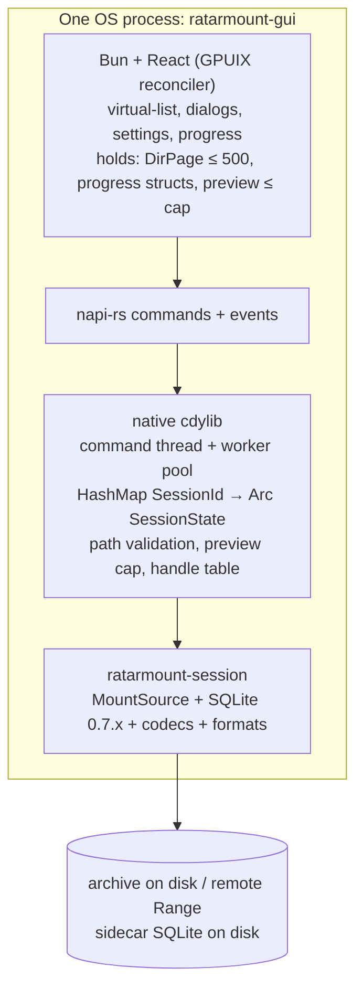
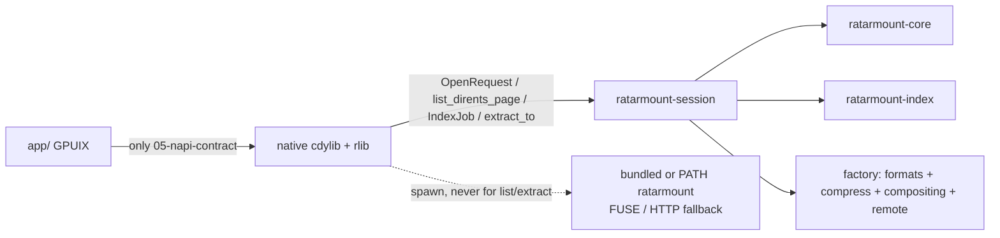
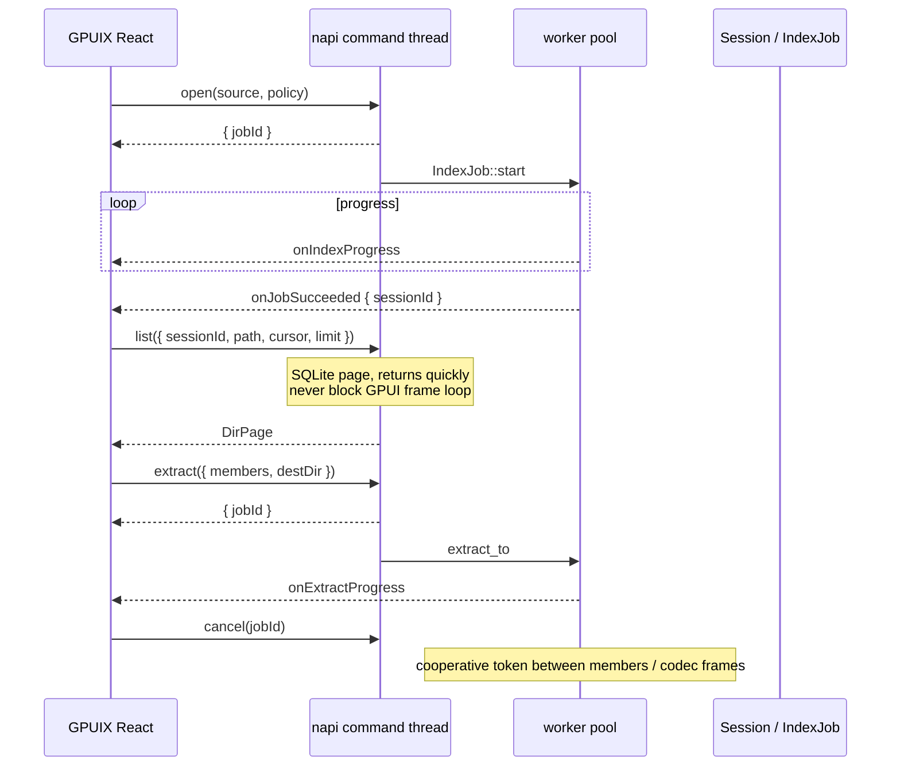
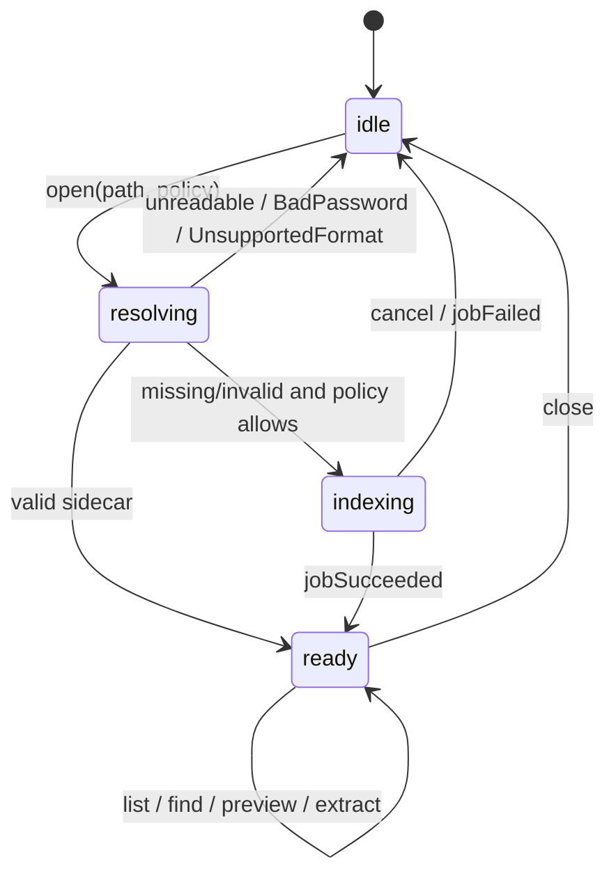
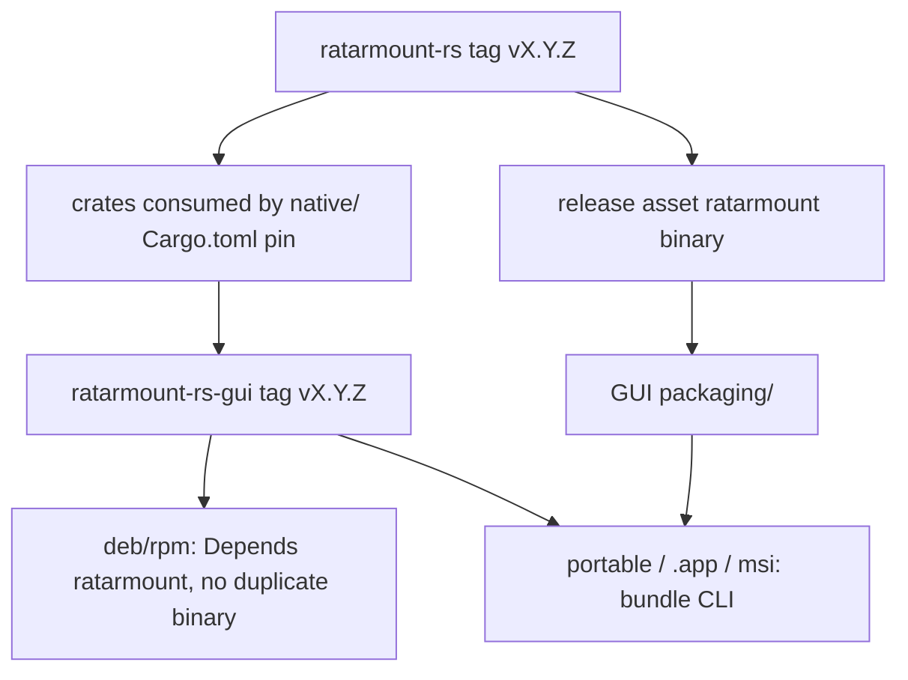
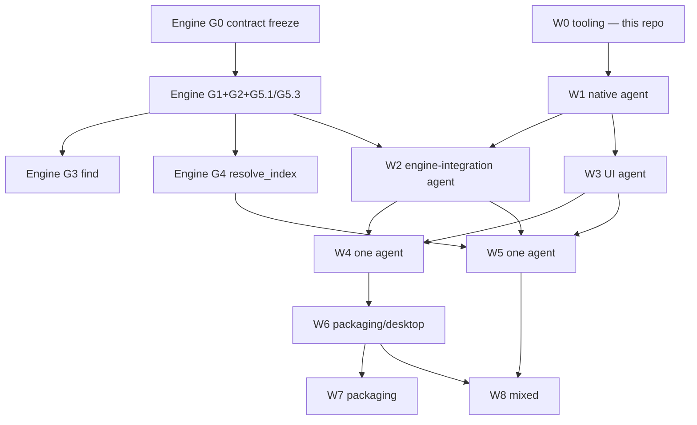

# ratarmount-rs-gui — Consolidated Design

| Field | Value |
|---|---|
| **Title** | Native GPUIX archive explorer for ratarmount-rs |
| **Author** | TBD (documentation seed, 2026-08-29) |
| **Date** | 2026-08-29 |
| **Status** | Draft |
| **Product** | `ratarmount-rs-gui` (spelling: **ratarmount-rs-gui**, not `ratarmout-rs-gui`) |
| **Engine** | [hilather/ratarmount-rs](https://github.com/hilather/ratarmount-rs) workspace `0.1.29` snapshot |
| **License** | MIT (same family as the engine; this project’s own 2026 copyright line) |
| **Repo** | `ratarmount-rs-gui` (documentation seed; no application code in this pass) |
| **Canonical copy** | This file. Scratch/skill copy: `/tmp/grok-brewerm/grok-design-doc-7e53b722.md` (keep in sync). |

This document synthesizes the planning pack at `/home/brewerm/Downloads/ratarmount-rs-gui-plans/` and the verified engine tree at `/home/brewerm/git/ratarmount-rs`. Living copies live in this GUI repository under `docs/`.

---

## Overview

`ratarmount-rs-gui` is a native GPU-rendered desktop archive explorer. The UI process is GPUIX (React reconciled onto Zed GPUI). Index, list, search, preview, and extract run in-process through a napi-rs cdylib that holds `ratarmount-session` (or `ratarmount-core::session` — engine G0.2). There is no Electron, no webview, and no GPUIX browser/Wasm target. Archive bytes, SQLite indexes, and members larger than the preview cap never enter the JavaScript heap as `Uint8Array` / Node `Buffer` / Bun `Blob`.

The engine today is a CLI factory plus export adapters (`ratarmount/src/factory.rs` lives in the **binary** crate, `ratarmount-fuse`, `ratarmount-http`, …). Verified on 2026-08-29: there is **no** `ratarmount-session` crate, index build with structured progress is CLI-only (`ratarmount --no-mount -c`), and `find` is CLI + control socket. The GUI therefore depends on engine phases G0–G7.

**Working G-list:** `docs/engine/gui-embedder-support.md` in **this** repo. The engine checkout has `docs/tasks/gui-embedder-support.md` (doc drop as of 2026-08-29) but no `ratarmount-session` crate. Until G0–G2 land, GUI and engine agents use this snapshot; after the crate/API exists, the engine file is canonical.

UI work can proceed against a fake in-memory catalog; it must not invent a second index format. Do **not** import the `ratarmount` binary crate to reach `factory.rs` — that is why W2 is gated on **G0** (crate home / factory extraction) as well as G1+G2.

---

## Background & Motivation

### Current state of the engine (verified)

| Claim | Evidence |
|---|---|
| Workspace crates, no session crate | Root `Cargo.toml` members: `ratarmount`, `ratarmount-core`, `ratarmount-index`, formats, compress, compositing, remote, fuse, http, nfs, smb, 9p, sftp, export-core. **No** `ratarmount-session`. |
| SQLite 0.7.x index | `ratarmount-index/src/lib.rs`: `INDEX_VERSION = "0.7.0"`; `create-index-tables.sql` is the 0.7.x `files` schema. Interoperable with Python ratarmountcore for TAR/ZIP/7z. |
| Sibling sidecars | `{archive}.index.ptr` → `{archive}.index.{id}.sqlite`; well-known `{archive}.index.sqlite`. |
| Remote sidecar cache | `$XDG_CACHE_HOME/ratarmount/meta-v3/`, cap `RATARMOUNT_META_CACHE_BYTES` default 256 MiB. **Exists.** `local-index-v1` for unwritable siblings **does not exist yet** (engine G4.3). |
| Index / find as library | `--no-mount -c` and `ratarmount find` are CLI entry points, not a supported embedder API. |
| Packaging | `.deb` / `.rpm` / portable glibc 2.31 tarball / macOS arm64 tarball; cosign; Intel macOS deferred (`docs/packaging.md`). |
| License | MIT, `Copyright (c) 2019-2022 Maximilian Knespel`. GUI uses MIT with a **this-project** 2026 copyright. |
| Windows | CLI is not a product target. Library crates must still compile without `fuser` so the explorer can land later (engine G6). |

### Pain points this product addresses

1. **Heap ceiling.** Chrome/Electron `ArrayBuffer` and wasm32 linear memory both cap around 2–4 GiB. Opening a multi-gigabyte `.tar.zst` through a webview or the GPUIX browser target is the original failure mode.
2. **FUSE is not browsing.** The CLI mounts well, but users who want 7-Zip / File Roller / The Unarchiver behavior (double-click, virtual list, extract selected members) should not be forced through a kernel filesystem.
3. **Process-hop listing is the wrong API.** Shelling out to `ratarmount` for `list` / `extract` reintroduces latency, makes cancel/progress messy, and invites dumping catalogs into the UI process.
4. **Index interop is already a product.** The 0.7.x SQLite sidecar is the contract with the CLI and with Python ratarmount. The GUI must write indexes the CLI can mount, and open indexes the CLI wrote.

### Why now

The engine’s `MountSource` + SQLite index + codecs already do the hard work. What is missing is a supported session API (open / paged list / ranged read / extract-to-disk / index job with progress+cancel) and a desktop UI that is forbidden from seeing archive bytes.

---

## Goals & Non-Goals

### Goals (v1)

1. Double-click or “Open with” a `.tar.zst` / `.tar.gz` / `.zip` / `.7z` / `.tar` and see a directory tree in **< 200 ms** if a valid sidecar exists (local SSD).
2. If no sidecar: build the ratarmount 0.7.x index with a cancelable progress bar, then browse.
3. Virtualized list of hundreds of thousands of members without hitching. Pages default **200**, max **500** dirents. No “load all paths into React state.”
4. Search by glob / FTS via engine `find`, **paged**.
5. Extract selected members (or all) to a chosen folder. Destination is a filesystem path. Never load the member into JS.
6. Preview small text / images under a hard cap (default **8 MiB**, native ceiling **64 MiB**).
7. Right-click in the file manager: Open, Extract here, Extract to…
8. Settings: index placement policy, preview cap, association management.
9. Optional Unix “Reveal as folder” (spawn bundled/PATH `ratarmount`) and “Share via HTTP” — **buttons**, not the product path.

### Non-goals (v1)

- Editing archives / write overlay UI (engine has `-w`; GUI later).
- In-app hex editor for multi-gigabyte members.
- Browser / Wasm / `bun run web` build.
- Replacing the CLI.
- Windows FUSE.
- Thumbnailing every file in a 2M-entry TAR on open.
- Auto-update (v1 = GitHub Releases).
- `ratarmount://` protocol URLs (deferred v1.1).
- Single-instance argv forwarding into an already-running app (acceptable v1: new process per invocation; v1.1 optional).

### Hard rules (non-negotiable; also in `AGENTS.md` and `README.md`)

1. **Never** materialize an archive, an index, or a member larger than the preview cap as a JS `Uint8Array` / Node `Buffer` / Bun `Blob`.
2. Do **not** use the GPUIX **browser/Wasm** target for opening large archives. Desktop napi-rs only.
3. Listing is paged from SQLite. No “load all paths into React state.”
4. FUSE is optional UX (“Reveal as folder”), not the product path.
5. Indexes are SQLite 0.7.x, interoperable with the CLI.
6. There is **no** `readAll` napi command.

### Constraints

| Constraint | Rule |
|---|---|
| Memory | Archive + index stay in Rust / SQLite / disk |
| JS payload | Dirent pages ≤ ~500 rows; preview ≤ cap |
| Engine version | GUI pins the same workspace version it was built against |
| Index format | SQLite 0.7.x only; CLI must mount what the GUI writes. **No new schema.** |
| Platforms v1 | Linux x86_64 + aarch64, macOS arm64. Windows as soon as session crates check (plus, not a v1 gate until G6). |
| FUSE | Optional button on Unix. Explorer works without it. |
| Preview ceiling | Native hard cap **64 MiB** even if the user types a larger number |

### Target repo layout (implementation waves fill this; not this documentation seed)

```
ratarmount-rs-gui/
  docs/                 # this seed
  app/                  # GPUIX React UI (Bun)          — W0
  native/               # Rust cdylib: napi + session    — W0 stub, W1 stubs, W2 real
  packaging/            # deb / rpm / macOS .app / msi   — W7
  integrations/         # .desktop, Info.plist, wix      — W6
  third_party/          # optional bundled CLI artifact  — W7
```

`native/` depends on `ratarmount-session` (or `ratarmount-core::session`) via path or git tag. Do **not** vendor the whole engine unless a release pin requires it. Do **not** import the `ratarmount` binary crate.

---

## Proposed Design

### Process shape

One OS process. GPUI paints the React tree on the GPU. That path is unrelated to archive I/O.



| Layer | Owns | Must not own |
|---|---|---|
| React (`app/`) | layout, selection, keymap, settings form, virtual list window | file bytes, SQLite, threads, format parsers |
| native cdylib (`native/`) | handle table, job table, path validation, preview cap, OS dialogs, config I/O | format parsers, a second index format |
| `ratarmount-session` (engine) | index, codecs, extract, find, `resolve_index` | UI |

### Crate / napi map



The UI is **wrong** if it calls anything except the napi contract in `docs/architecture/05-napi-contract.md`.

Engine G5.3: the session feature set **must not** pull `ratarmount-fuse`, `ratarmount-nfs`, `ratarmount-smb`, or `ratarmount-http` unless those features are explicitly requested. Explorer browse/extract is FUSE-free.

### Data that may cross napi

**Allowed** JSON-ish values:

- session id (`u64`), job id (`u64`)
- paths (strings)
- `DirPage` / `DirEnt` / `FindPage`
- `IndexProgress`, extract progress (`bytes_out`, `files_done`, `current_path`)
- preview: text string or native-resized PNG **only after** native enforces `len ≤ preview_cap` (and the 64 MiB ceiling). Shapes are in [05-napi-contract.md](docs/architecture/05-napi-contract.md) (`kind: 'text' | 'image' | 'skipped'`).
- opaque `cursor: string` for paging (native must **not** expose raw SQLite `offset: u64` as the JS paging API)
- errors and `jobFailed`: `{ code, message, retryable }` (see 05 for which codes retry)
- config blobs (policy strings, numeric caps)

**Forbidden:**

- raw SQLite file contents
- full member body
- `Vec<u8>` of the archive
- a `readAll` command

Extract destination is a filesystem path. Preview of a large file is “open with system handler after extract-to-temp.”

**`docs/architecture/05-napi-contract.md` is the source of truth** for every JS-visible type (`DirPage`, `DirEnt`, `FindPage`, `Config`, preview, events). Living `01-architecture.md` points at 05; do not reintroduce a `bytesBase64` sketch.

### Threading



Rules:

- napi command functions return quickly with a `jobId` for large work (`open` when an index must be built, `extract`).
- Index build / extract / remote open run on a dedicated pool.
- Progress is pushed as events (`indexProgress`, `extractProgress`).
- Cancel sets a token; jobs must check it between members / codec frames.
- **Do not block the GPUI frame loop on SQLite.**
- `Session` must be `Send` (engine **G5.1** — required for W2, not optional polish).
- Session default features must not pull fuse/nfs/smb/http (engine **G5.3**; fallback: `default-features = false` + documented allowlist).
- Worker panic: surface error, drop that session, keep other tabs.

### Session lifecycle



- Multiple sessions allowed (tabs). Default v1: **one active archive per window**, multiple windows OK.
- Native keeps `HashMap<SessionId, SessionState>`. Drop on `close` and on process exit. **Do not expose raw pointers to JS.**
- If an index must be built, `open` returns `{ jobId }` first; `sessionId` arrives on `jobSucceeded`.

### Index policies

Indexes are SQLite 0.7.x sidecars. The GUI **must not reimplement discovery**. Call the engine helper (`resolve_index` once G4 lands; until then `ratarmount-index::resolve_index_location` / whatever `Session::open` wraps). Putting locally built remote indexes in `local-index-v1` vs `meta-v3` is an **engine** decision (G4.3 vs G4.5).

**Do not use `/tmp` as the default.** A 2 TiB backup TAR can produce a multi-hundred-megabyte index. `/tmp` is often tmpfs, world-readable, and wiped on reboot. Temp is an explicit policy, not the fallback.

| Policy id | Where the sidecar is written | When to use |
|---|---|---|
| `sibling` | `{archive}.index.ptr` + `{archive}.index.{id}.sqlite` | **Default** for local, writable directories |
| `user-cache` | `…/ratarmount/local-index-v1/` keyed by canonical path + size + mtime + inode/file-id | Default **fallback** when sibling is not writable; also for `http(s)` / `s3` after remote sidecar miss |
| `explicit` | User-chosen file (`index.explicit_path`) | External disk / shared index store |
| `memory` | `:memory:` | Tests only; hidden in UI |
| `temp` | Platform temp dir, deleted on session close | “Inspect once, throw away.” Confirm in UI. |

`Recreate` is orthogonal: `never` | `if-invalid` | `always`.

**Today’s CLI order (engine 0.1.29, `resolve_index_location`):** explicit `--index-file` (`:memory:` / path / URL) → folder candidates from `default_index_folders()` = sibling (empty folder) + **`$XDG_CACHE_HOME/ratarmount`** (the **parent** of `meta-v3`, flattened `{archive_path_with_slashes_as_underscores}.index.sqlite` names) + `~/.ratarmount` → sibling `.index.ptr` pointer candidates → remote `meta-v3` for URL sources → first writable create path → **last resort `:memory:`**. `local-index-v1/` does **not** exist. That parent folder is **legacy CLI cache**, not the GUI user-cache path.

**Post-G4 target** (engine `resolve_index`; GUI consumes it):

1. `explicit` path if policy is explicit
2. Sibling `.index.ptr` → `.index.{id}.sqlite`
3. Sibling `.index.sqlite`
4. Extra folders from `index.extra_dirs` (maps to CLI `--index-folders`)
5. `user-cache` `local-index-v1` (sha256 keys — **not** flattened names in the parent)
6. Remote `meta-v3` (URL sources) — **already in the engine; do not invent a second one**
7. Build new at the location implied by policy (not `:memory:` unless policy is `memory`)

If W2 writes sha256 keys into `local-index-v1/` before G4, the CLI will not find them (or will fall back to `:memory:`). Pre-G4, W2 follows **today’s** resolver.

If policy is `sibling` and the directory is not writable → structured error `SiblingNotWritable` (G4.2). GUI offers “Save index in user cache instead” and remembers per-volume if the user checks “always for this filesystem.”

`--publish-index` behavior: GUI “Write pointer next to archive” checkbox, default on when policy is sibling.

Cancel mid-write (engine G2.3): write to `.tmp` then rename; leave a valid old sidecar.

### Optional FUSE / HTTP

These are **buttons**, implemented by calling the engine — not by the UI pretending to be a filesystem.

| Action | Implementation |
|---|---|
| Reveal as folder | spawn bundled or PATH `ratarmount` on a mountpoint, then `xdg-open` / `open` |
| Share via HTTP | `Session::start_http(bind)` if G5.4 exists; else spawn `ratarmount --http --no-fuse…` |
| Unmount / stop share | matching stop API or `ratarmount -u` |

If the CLI binary is absent, **hide** those actions. FUSE probe failure (no macFUSE / no fuse3) also hides “Reveal as folder.”

On startup, if PATH `ratarmount --version` ≠ bundled, **prefer bundled** for FUSE/HTTP spawned from the GUI. Show a settings note when they differ.

### Distribution

**Decision: link the engine crates in-process. Also ship the `ratarmount` CLI in standalone installers.**

Do **not** make the GUI a wrapper that shells out for `list` / `extract`.

| Piece | Role |
|---|---|
| Linked crates (`ratarmount-session` + deps) | Browse, index, extract, search. **Required.** |
| Bundled `ratarmount` CLI | FUSE “Reveal as folder”, familiar CLI on PATH, `--http` fallback if session HTTP is not ready, same version as the GUI |
| System `ratarmount` on PATH | Used only if bundle missing and versions match |

**Version pin:** GUI release `X.Y.Z` bundles CLI `X.Y.Z` from the same ratarmount-rs tag.

**v1 packaging split:**

- Distro packages (`.deb` / `.rpm`): GUI **`Depends: ratarmount (>= X.Y.Z)`** and does **not** ship `/usr/bin/ratarmount` (avoids file conflict with the engine package).
- Portable tarball / macOS `.app` / Windows msi: **bundle** the CLI because there is no package manager guarantee.



Linux package layout (proposed):

```
/usr/bin/ratarmount-gui
/usr/share/applications/ratarmount-gui.desktop
/usr/share/mime/packages/ratarmount-gui.xml
/usr/share/icons/hicolor/.../ratarmount-gui.png
/usr/share/doc/ratarmount-gui/
```

CLI comes from the engine package on distros. Portable / `.app` / msi place `ratarmount` next to the GUI (macOS: `Contents/MacOS/ratarmount`).

libarchive: prefer **static link** in the native cdylib so the GUI does not depend on Homebrew kegs at runtime.

Runtime: Linux needs a GPU driver + glibc matching the portable baseline; fuse3 is optional. macOS FUSE runtime is optional (Reveal as folder). Windows does **not** need WebView.

v1 auto-update: **none**. GitHub Releases. Reuse engine cosign/OIDC if the same GitHub org publishes GUI artifacts.

### OS integration

Behave like 7-Zip / File Roller / The Unarchiver.

| Action | Invocation | Behavior |
|---|---|---|
| Open | `ratarmount-gui <archive>` | Open window, resolve index, browse |
| Extract here | `ratarmount-gui --extract-here <archive>` | Index if needed, extract all members next to archive; no window if `--silent` |
| Extract to… | `ratarmount-gui --extract-to <dir> <archive>` | Native folder picker if dir omitted |
| Index only | `ratarmount-gui --index-only <archive>` | Build sidecar per policy, then exit |
| Reveal as folder | in-app only | spawn CLI FUSE |

Multiple files: v1 opens one window per archive (or tabs if cheap). `--extract-here` may take many paths.

- **Linux:** `ratarmount-gui.desktop` + MIME xml for compressed-TAR types some desktops only know as `application/zstd`. Desktop action Extract here. Postinst: `update-desktop-database` + `update-mime-database`. Do **not** silently steal `inode/directory`. Settings checkbox: “Become default handler for TAR/ZIP/7z.”
- **macOS:** `Info.plist` `CFBundleDocumentTypes` + exported UTIs. Role: **Viewer** (not Editor) in v1. Gatekeeper: signed + notarized `.app` when a cert exists; until then document “Right-click → Open.”
- **Windows:** HKCU `OpenWithProgids` + `shell\open` / `ExtractHere` / `ExtractTo`. ExtractTo command is `ratarmount-gui.exe --extract-to -- "%1"` — `%1` is the **archive**, not `destDir`. Do **not** register as handler for `.exe` or `.msi`. Display name: `Name=ratarmount`; binary/id `ratarmount-gui`.

**Extract here security:**

- Refuse paths that escape the destination (`../`, absolute members) unless the user enables “allow unsafe paths.” Native returns `PathEscape`; do not write.
- Default destination = directory containing the archive.
- Show a summary (`N files, M bytes`) before extract when `N > 1000` or `M > 1 GiB` (`extractPlan`).
- Overwrite `'ask'` is UI-only. Native `extract` accepts `'skip' | 'replace'` only. `--silent` maps `ask` → `skip` and must not hang.

### Failure domains

| Failure | Behavior |
|---|---|
| Unreadable archive | modal, no session |
| Unwritable sibling dir | `SiblingNotWritable` → offer cache policy |
| Corrupt sidecar | `Recreate::IfInvalid` |
| Preview over cap | disable inline preview, offer extract |
| Worker panic | surface error, drop that session, keep other tabs |
| Bad password | `BadPassword`; W4 modal retries `open`; password JS-lifetime = that call; never in config/state/logs |
| CLI / FUSE missing | hide Reveal as folder / HTTP share |

### Test seams

- Native crate exposes the same commands to a headless harness (`native --self-test` / `cargo test -p native`) so waves can land without GPUIX.
- UI tests use GPUIX automation (`getByTestId`) against fixtures, **never** against a 40 GiB archive in CI.
- Fake backend behind `RGUI_FAKE=1` until G0+G1+G2 land; real path feature-gated.
- If blocked on engine API: implement against the G0 sketch and leave `TODO(engine)` — **do not invent a second index format.** Do **not** import the `ratarmount` binary crate.

### Latency / scale targets

| Metric | Target |
|---|---|
| Warm open, first `DirPage`, local SSD, valid sidecar | < 200 ms |
| `list` page size | default 200, max 500 |
| Virtual list | hundreds of thousands of members; W8 checks 100k fixture with no JS array of 100k |
| Preview default | 8 MiB |
| Preview native ceiling | 64 MiB |
| Local index cache | default 2 GiB, LRU by last-open, `RATARMOUNT_LOCAL_INDEX_CACHE_BYTES` |
| Remote sidecar cache | 256 MiB, `RATARMOUNT_META_CACHE_BYTES` (engine-owned `meta-v3`) |
| Extract confirm | `N > 1000` or `M > 1 GiB` |
| Image preview | native decode + resize ≤ 2048 px long edge, PNG ≤ `preview.max_bytes` |

---

## API / Interface Changes

The napi contract is the UI’s **only** allowed surface. Agents implementing UI against anything else are wrong. **Full TypeScript/JSON types live in `docs/architecture/05-napi-contract.md` (SoT).** Summary of implementer-required shapes:

```ts
type Cursor = string  // opaque keyset; JS must not parse; native must not return offset:u64 as paging API

interface DirEnt {
  name: string
  path: string
  isDir: boolean
  size: number
  mtime: number | null
  mode: number
  archiveOffset?: number  // catalog hint only; not a read API
}

interface DirPage {
  path: string
  entries: DirEnt[]
  nextCursor: Cursor | null
  totalHint: number | null
}

interface FindPage {
  pattern: string
  mode: 'glob' | 'fts'
  entries: DirEnt[]
  nextCursor: Cursor | null
  totalHint: number | null
}

interface ExtractPlan {
  files: number
  bytes: number
  conflictCount: number
  conflicts: { member: string; destPath: string }[]  // sample ≤ 50
  conflictsTruncated: boolean
}

// Config matches config.toml keys (camelCase on the wire). See 05 for the full interface.
```

Engine G0 sketch `DirPage.offset` / `next_offset` stay **inside native**.

`open` policy includes hidden/test-only `'memory'`. v1 `recursive` defaults **false**; `recursive: true` without `recursionDepth` uses the **engine default** depth. Password is accepted only on `open` (W4 dialog; not stored in React state/config).

**Overwrite protocol:** `'ask'` is UI-only (`Config.extract.overwrite` / `config.toml`). Native `extract({ overwrite })` accepts **`'skip' | 'replace'` only** and rejects `'ask'`. UI calls `extractPlan` (`files`/`bytes` from index aggregates; **capped** conflict sample ≤ 50 plus `conflictCount` / `conflictsTruncated`) then `extract`. Native dest-stat loop caps at 10_000 rows or 250 ms so extract-all planning cannot dump a catalog into JS or block the frame loop. v1 is not a `{ jobId }` because of those caps. `--silent` maps `ask` → `skip` and must not hang.

Events: `indexProgress`, `extractProgress`, `jobSucceeded`, `jobFailed` (`{ jobId, code, message, retryable }`), `jobCancelled`.

`retryable: true` → `Busy`, `NotWritable`, `SiblingNotWritable`.  
`retryable: false` → `PathEscape`, `BadPassword`, `UnsupportedFormat`, `NotFound`, `CorruptIndex`, `Cancelled`, `PreviewTooLarge`, `Internal`.

**There is no `readAll(path)`.**

CLI argv (W6; native wrapper, not React):

```
ratarmount-gui <archive>…
ratarmount-gui --extract-here <archive>…
ratarmount-gui --extract-to [DIR] <archive>   # omit DIR (or --extract-to -- <archive>) → folder picker
ratarmount-gui --index-only <archive>
ratarmount-gui --silent …                    # ask → skip; no dialog
```

Windows ExtractTo: `ratarmount-gui.exe --extract-to -- "%1"` (`%1` = archive).

---

## Data Model Changes

**No new SQLite schema.** Reuse engine 0.7.x (`files` PK `(path, name, offsetheader)`, `metadata` table for tarstats / arguments, optional `files_fts` which Python ignores). GUI-built sidecars must pass engine G7.1 (`ratarmount archive mnt` accepts them) and G7.3 (Python 0.7.x subset).

### Config (`config.toml`)

| OS | Path |
|---|---|
| Linux | `${XDG_CONFIG_HOME:-$HOME/.config}/ratarmount-gui/config.toml` |
| macOS | `~/Library/Application Support/ratarmount-gui/config.toml` |
| Windows | `%APPDATA%\ratarmount-gui\config.toml` |

```toml
[index]
policy = "sibling"                 # sibling | user-cache | explicit | temp
explicit_path = ""
extra_dirs = []
recreate = "if-invalid"            # never | if-invalid | always
local_cache_bytes = 2147483648
remember_unwritable_volumes = true

[preview]
max_bytes = 8388608
open_large_with_system = true

[extract]
overwrite = "ask"                  # ask | skip | replace; 'ask' is UI-only
allow_unsafe_paths = false

[engine]
bundle_cli = true
cli_path = ""                      # empty = bundled then PATH

# W8: recent archives are paths only
# [recent]
# paths = []
```

Passwords are **never** stored in config or React state. Engine G5.2: secrecy / zeroize; never logged. W4 owns the password dialog; the JS string exists only for the `open` call.

### Index sidecar layout

Sibling (default):

```
backup.tar.zst
backup.tar.zst.index.ptr          # pointer, small
backup.tar.zst.index.{id}.sqlite  # 0.7.x blob
```

User-cache (`local-index-v1`) — **not** `meta-v3`:

| OS | Path |
|---|---|
| Linux | `${XDG_CACHE_HOME:-$HOME/.cache}/ratarmount/local-index-v1/` |
| macOS | `~/Library/Caches/ratarmount/local-index-v1/` |
| Windows | `%LOCALAPPDATA%\ratarmount\local-index-v1\` |

Key file name (**post-G4**): `sha256(canonical_path + '\0' + size + '\0' + mtime_ns + '\0' + file_id).sqlite` plus a `.json` sidecar with the inputs so the UI can show “index for /data/foo.tar”.

Env: `RATARMOUNT_LOCAL_INDEX_DIR`. Cap: `RATARMOUNT_LOCAL_INDEX_CACHE_BYTES` (default **2 GiB**). LRU by last-open time.

**Legacy CLI folder (not GUI user-cache):** `$XDG_CACHE_HOME/ratarmount/` (parent of `meta-v3`) + `~/.ratarmount/` with flattened names. Do not write GUI sidecars there.

Remote sidecar cache (engine-owned, do not fork):

| OS | Path |
|---|---|
| Linux | `${XDG_CACHE_HOME:-$HOME/.cache}/ratarmount/meta-v3/` |
| macOS | `~/Library/Caches/ratarmount/meta-v3/` (or XDG if set) |
| Windows | `%LOCALAPPDATA%\ratarmount\meta-v3\` |

Temp policy: `${TMPDIR:-/tmp}/ratarmount-gui-$UID/index-$SESSION.sqlite`, mode **0700**. Unlink on close and sweep stale on next launch.

Cache dirs mode **0700**. “Clear index cache” wipes `local-index-v1` only (not the user’s sibling files).

### Handle tables (native, process-local)

Not persisted.

```text
sessions: HashMap<SessionId, SessionState>   # Arc<Session>, source path, resolved index path, policy
jobs:     HashMap<JobId, JobState>           # kind, cancel token, optional sessionId on success
```

Drop on `close` / process exit. Session ids are monotonic `u64`, not raw pointers.

### Migration

v1: first config write creates directories with 0700. No schema migration. If engine later adds optional tables (e.g. `files_fts`), GUI still treats the blob as 0.7.x; it does not migrate Python indexes into a new format.

---

## Alternatives Considered

### 1. Electron / webview (rejected)

**Idea:** Chromium shell, React already, mature packaging.

**Trade-offs:** `ArrayBuffer` ~2–4 GiB ceiling is the original failure mode. Extra process, extra RAM, extra attack surface (Chromium). Archive I/O would still need a native addon — at which point Chromium is dead weight. WebView2 on Windows is explicitly **not** required because GPUI is native.

**Severity if chosen:** High — cannot open the archives this product exists to open.

### 2. Shell-out to CLI for list / extract (rejected)

**Idea:** GUI is a thin launcher; `ratarmount --no-mount -c`, parse `find` stdout, extract via a new CLI flag.

**Trade-offs:** Process-hop latency on every page; progress/cancel is SIGTERM rather than a cooperative token; stdout parsing is a second API that will drift from the CLI; easy to accidentally `cat` a member into the UI process. The engine already has the data structures in-process (`MountSource`, SQLite).

**Severity if chosen:** Medium–High — works for tiny archives, collapses on 100k+ catalogs and cancelable multi-GB extracts.

### 3. GPUIX browser / Wasm target (rejected)

**Idea:** One codebase for desktop and web via `bun run web`.

**Trade-offs:** wasm32 linear memory has the same ~2–4 GiB cap. SQLite + codecs in Wasm would still need to copy bytes into JS/Wasm memory. Hard rule 2 forbids this for opening large archives.

**Severity if chosen:** High — same heap failure mode as Electron.

### 4. In-process session + bundled CLI (accepted)

**Idea:** Link `ratarmount-session` into the native cdylib for browse / index / extract / search. Ship the `ratarmount` CLI in standalone installers (and depend on the engine package on distros) for FUSE “Reveal as folder”, HTTP fallback, and version-matched CLI on PATH.

**Trade-offs:** Requires engine G0–G7 work that does not exist today (no session crate as of 0.1.29). Two artifacts to version-pin. Distro file-conflict risk on `/usr/bin/ratarmount` — mitigated by **Depends**, not duplicating the binary. Native crate must enforce caps because React cannot be trusted with bytes.

**Why this wins:** Matches the engine’s existing architecture (crates are already library-shaped; the CLI is a factory). Meets the heap constraint. Lets FUSE remain optional UX. Preserves 0.7.x interop. Allows W3 UI to proceed on a fake catalog while G1+G2 land.

---

## Security & Privacy Considerations

### Threat model (v1 desktop, local user)

| Threat | Severity | Mitigation |
|---|---|---|
| Archive member `../` or absolute path on extract | **High** | Native path check; `PathEscape`; default refuse; “allow unsafe paths” opt-in |
| Preview decoder bomb (crafted image) | **High** | Decode + resize in Rust with size cap; fail to `skipped`; never decode in JS |
| World-readable index in `/tmp` or 0777 cache | **Medium** | `/tmp` is not the default; cache dirs **0700**; temp policy uses `ratarmount-gui-$UID` 0700 |
| Password logged or written to `config.toml` | **High** | secrecy/zeroize (G5.2); never in config; never in logs |
| Archive member names in world-readable logs | **Medium** | Debug logs only; do not log member names at info; crash logs documented and mode-restricted |
| JS heap copy of archive / index / huge member | **High** | Hard rule 1; code review of `native/` public fns; no `readAll` |
| Registering as handler for `.exe` / `.msi` / `inode/directory` | **High** | Explicit non-registration; no silent steal of directories |
| Sibling index on a shared photo SD card | **Low–Medium** | `user-cache` policy + remember-volume |
| FUSE spawn of an unexpected binary | **Medium** | Prefer bundled CLI of the same tag; version mismatch note; hide if missing |
| Worker panic / use-after-close | **Medium** | Opaque handles; drop session; other tabs survive |

AuthN/AuthZ: none in v1 (single-user desktop). Remote archives reuse engine credentials (env / existing ratarmount remote auth); GUI must not persist passwords.

“Clear local index cache” is a privacy control: wipes `local-index-v1` only.

---

## Observability

| Signal | Where | Notes |
|---|---|---|
| Resolved index path | native debug log + status bar (shortened, with policy badge) | Used by W5; do not log at info in production by default |
| Index / extract progress | napi events | `phase`, `bytesScanned`, `entries`, `bytesOut`, `filesDone` |
| Job terminal states | `jobSucceeded` / `jobFailed` / `jobCancelled` | `code` + `message`; `retryable` on errors |
| Panic in worker | error modal + crash log | Drop that session; document crash log location in W8 |
| CLI version mismatch | settings note | Bundled vs PATH |
| Metrics (v1) | none required | Optional later: open latency histogram, page latency, index build duration — process-local, no telemetry backend |
| Alerting | n/a for v1 desktop | CI gates replace production alerts |

Do **not** log passwords, archive member names in world-readable logs, or secrets.

W8 documents the crash log path. Native `--self-test` is the headless health check.

---

## Rollout Plan

This repository implements GUI waves W0–W8. Engine phases G0–G7 live in **ratarmount-rs** and are an **external dependency**, not PRs in this repo.

**External engine PR (not in this PR Plan):** G0.1 doc drop is in `ratarmount-rs/docs/tasks/gui-embedder-support.md`; G0–G2 / `ratarmount-session` are still missing. Until the crate/API lands, the snapshot in this repo is the working G-list.

### Suggested first slice (ship a demo)

- **Engine:** G0 (crate home / factory extraction) + G1 + G2 + G3; G5.1 `Send` and G5.3 fuse-free defaults (fold into G1 acceptance or require explicitly).
- **GUI:** W0 + W1 + W2 + W3 virtual list of **one TAR**.
- Fake catalog is enough for W3 chrome; W2 replaces the fake once G0+G1+G2 merge.

### Wave / PR mapping (this repo)

| Wave | PR | Parallelism | Engine gate |
|---|---|---|---|
| W0 scaffold | PR 1 | — | none |
| W1 napi stubs + fake catalog | PR 2 | after PR 1 | none |
| W3 explorer chrome | PR 3 | **parallel with PR 4** after PR 2 | none (fake session OK) |
| W2 wire session | PR 4 | **parallel with PR 3** after PR 2 | **G0 + G1 + G2 + G5.1 + G5.3** |
| W4 extract/preview/jobs | PR 5 | after PR 3 and PR 4 | G1 extract + G1.4 read_range |
| W5 settings + index policy | PR 6 | after **PR 3 and PR 4** | **G4** |
| W6 OS integration | PR 7 | after PR 5 | none |
| W7 installers + CLI bundling | PR 8 | after PR 7 | engine **release assets** |
| W8 polish | PR 9 | after PR 6 and PR 7 | G3 find; G5.4 HTTP optional |

### Feature flags

- `RGUI_FAKE=1` (or cargo feature `fake-session`): in-memory catalog; W1/W3.
- Cargo features on `native/`: do **not** enable fuse/nfs/smb/http unless W8 HTTP-on-session is explicitly on.
- Preview cap in config; native clamps to 64 MiB.

### Staged rollout

1. Documentation seed (this pass) — no application code.
2. Hello window + native self-test against fake catalog (W0–W1).
3. Virtual list of one fixture TAR (W3 fake, then W2 real).
4. Extract / preview on fixtures (W4).
5. Policy + unwritable sibling (W5, needs G4).
6. Desktop/MIME/plist (W6) then installers (W7).
7. Search / FUSE / HTTP / 100k perf / a11y (W8).
8. Manual 4 GiB `.tar.zst` acceptance (`docs/design/07-acceptance.md`). Windows open/extract is a **plus**, not a gate, until G6 is green.

### Rollback

- Each PR is independently reviewable. Revert the PR.
- Fake backend remains until W2 is proven; `RGUI_FAKE=1` is the rollback if session wiring regresses.
- Distro packages: GUI Depends engine; uninstalling GUI does not remove the CLI.
- Indexes: cancel/tmp+rename so a failed GUI index build does not corrupt a CLI sidecar.

---

## Open Questions

Decisions already made in the pack are recorded under **Key Decisions**, not reopened here. Remaining genuine questions:

1. **Engine crate home (G0.2):** new `ratarmount-session` crate vs `ratarmount-core::session` plus re-exports. GUI `native/Cargo.toml` will pin whichever G0.2 picks. Prefer the dedicated crate so the GUI never imports the `ratarmount` binary crate, but this is an engine call.
2. **GUI native dependency source until crates.io publish:** path/submodule sibling checkout vs git tag. Engine **`ratarmount-rs/docs/crates-io-policy.md`** (not a file in this repo) currently treats library publish as optional; CI of this repo should start on a **git tag pin** (or path-dep in a documented sibling layout) and switch to crates.io only if the engine publishes L0–L4 + session.
3. **Apple Developer ID for notarized `.app`:** ops, not architecture. Until a cert exists, document Right-click → Open (same as the engine macOS tarball).
4. **Windows installer format:** `.msix` vs WiX `.msi`. W6 ships a registry fragment either way; W7 picks the tool when G6 is in sight.
5. **Distro FUSE spawn when GUI Depends engine:** if the installed CLI is older than the GUI pin, “Reveal as folder” may drift. Options: hide on mismatch, or later ship a private `ratarmount-gui-engine` binary that never owns `/usr/bin/ratarmount`. v1: hide or warn on mismatch; do not duplicate `/usr/bin/ratarmount`.

---

## References

- Planning pack: `/home/brewerm/Downloads/ratarmount-rs-gui-plans/`
- This repo: `docs/architecture/01-architecture.md` … `05-napi-contract.md`, `docs/design/00-overview.md`, `docs/design/07-acceptance.md`, `docs/implementation/06-agent-waves.md`, `docs/implementation/waves/W0.md`–`W8.md`, `docs/implementation/plan.md`
- Engine task list **working copy:** `docs/engine/gui-embedder-support.md` (this repo). Engine `docs/tasks/gui-embedder-support.md` exists (doc drop as of 2026-08-29); G0–G2 / `ratarmount-session` are still missing. After the crate/API exists, the engine file is canonical.
- Engine: [hilather/ratarmount-rs](https://github.com/hilather/ratarmount-rs) — `Cargo.toml`, `ratarmount-index` (`INDEX_VERSION` 0.7.0), `docs/packaging.md`, **`ratarmount-rs/docs/crates-io-policy.md`** (engine tree, not this repo), `LICENSE`
- ADR: `docs/adr/0001-in-process-session.md`
- Agent policy: `AGENTS.md`

---

## Key Decisions

1. **In-process `ratarmount-session` + bundled/Depends CLI.** Browse/index/extract/search link crates. FUSE/HTTP buttons spawn the version-matched CLI (or session HTTP if G5.4). Not Electron, not Wasm, not shell-out for list/extract. *Rationale:* heap ceiling + cancel/progress + 0.7.x interop. See ADR 0001.
2. **One OS process, GPUIX desktop napi-rs only.** React never sees archive bytes. *Rationale:* GPUI paint is unrelated to I/O; browser target repeats the 2–4 GiB failure.
3. **napi contract is the only UI surface; no `readAll`.** Native owns path validation, preview cap, handle table. *Rationale:* reviewable boundary; agents cannot “just this once” copy bytes into JS.
4. **SQLite 0.7.x only; no new schema.** Same sibling `.index.ptr` / `.index.{id}.sqlite`. GUI consumes engine `resolve_index` (post-G4 target); pre-G4 follows **today’s** `resolve_index_location` (memory last resort; legacy `$XDG_CACHE_HOME/ratarmount/` parent). *Rationale:* GUI-built indexes must mount with `ratarmount archive mnt` and vice versa.
5. **`sibling` is the default index policy; `/tmp` is never the implicit fallback.** `user-cache` (`local-index-v1`, not `meta-v3`, not the legacy parent folder) is the fallback for unwritable siblings **after G4**. Temp policy is explicit + confirmed. *Rationale:* huge indexes, tmpfs, world-readable `/tmp`.
6. **Paged listing, max 500 dirents; virtual list.** *Rationale:* 2M-entry TARs cannot land in React state.
7. **FUSE is optional UX, not the product.** Explorer works with zero FUSE. Hide actions if CLI/FUSE missing. *Rationale:* Windows library path, machines without macFUSE, users who only want extract.
8. **Preview default 8 MiB, native hard ceiling 64 MiB.** Images decoded/resized in Rust (≤ 2048 px). Over-cap → `skipped` + extract-and-open-with-system. *Rationale:* decoder bombs and JS heap.
9. **Distro packages Depends engine; standalone bundles CLI.** Never two owners of `/usr/bin/ratarmount`. Version pin GUI `X.Y.Z` = engine tag `X.Y.Z`. *Rationale:* file conflict vs machines without a package manager.
10. **Extract path-escape refused by default.** Confirm when `N > 1000` or `M > 1 GiB`. *Rationale:* zip-slip class bugs.
11. **W3 (explorer chrome) and W2 (real session) run in parallel after W1**, W3 on a fake catalog. *Rationale:* engine G0+G1+G2 will lag; UI must not invent indexes while waiting.
12. **If blocked on engine API: G0 sketch + `TODO(engine)`.** Fake backend `RGUI_FAKE=1`. Do not import the `ratarmount` binary crate. *Rationale:* do not fork the index format.
13. **Platforms v1: Linux x86_64 + aarch64, macOS arm64.** Windows when session crates compile; not a v1 gate until G6. MIT license, 2026 copyright for this project.
14. **Passwords never in config, React state, or logs.** W4 owns the password dialog; JS lifetime is the `open` call. Cache dirs 0700. Do not log member names in world-readable logs.
15. **This documentation seed does not scaffold `app/` or wire `native/`.** That is W0/W1 implementation. Docs, `AGENTS.md`, `LICENSE`, `.gitignore` land first.
16. **Display name `ratarmount`; binary / `.desktop` id `ratarmount-gui`.** Window title “ratarmount”. Decided (pack / 04); not reopened.
17. **Native `extract` overwrite is `'skip' | 'replace'` only.** `'ask'` is UI-only via `extractPlan`. `extractPlan.conflicts` is a **sample ≤ 50** plus `conflictCount` / `conflictsTruncated`; dest-stat scan caps at 10_000 rows or 250 ms. `--silent` maps ask → skip.
18. **W2 engine gate is G0 + G1 + G2 + G5.1 (`Send`) + G5.3 (fuse-free defaults).** Fallback: `default-features = false` + allowlist. G5.1/G5.3 may be folded into G1 acceptance on the engine side.

---

## Agent Wave Execution Plan

How to run this with waves of subagents. The orchestrator-facing plan also lives at `docs/implementation/plan.md`.

### Ownership and parallelism



| Wave | Repo | Goal | Depends on | Owner role | Parallel with |
|---|---|---|---|---|---|
| G0–G7 | **ratarmount-rs** (external) | session API, index job, resolver, windows lib | — | engine | W0, W1, W3 (GUI fake) |
| W0 | gui | repo, GPUIX hello, native stub, CI skeleton | docs seed | tooling | engine G* |
| W1 | gui | napi stubs + self-test + fake catalog | W0 | native | — |
| W2 | gui | real Session behind napi | W1 + **G0+G1+G2+G5.1/G5.3** | engine-integration | **W3** |
| W3 | gui | explorer chrome: open, breadcrumbs, virtual list | W1 (fake OK) | UI | **W2** |
| W4 | gui | extract + preview + jobs + password | W2 + W3 | **one agent** (UI+native) | — |
| W5 | gui | config.toml + index policies | W2 + **W3** + **G4** | **one agent** (UI+native) | W6 after W4 (not with W5) |
| W6 | gui | argv, desktop/plist/registry | W4 | packaging / desktop | can start while W5 waits on G4 |
| W7 | gui | installers, CLI bundle/depends | W6 + engine packages | packaging | — |
| W8 | gui | search, fuse/http, a11y, perf | W5 + W6 | mixed | — |

**Isolation so parallel worktrees do not collide:**

| Role | Owns (write) | Must not touch |
|---|---|---|
| tooling (W0) | `app/` scaffold, `native/` stub crate files, CI workflow, README run section | architecture docs 01–05 (already seeded) |
| native (W1, W2) | `native/` | `app/` components except documented import of the addon |
| UI (W3) | `app/` | `native/` command implementations; may consume the napi types |
| W4 / W5 (one agent) | `native/` + `app/` for that wave | packaging/; do not start W5 `app/` until W3 (PR 3) is merged |
| packaging (W6, W7) | `integrations/`, `packaging/`, argv in native main, Info.plist | explorer React tree except association settings widgets |
| engine repo | `ratarmount-rs` only | **never** this GUI repo; GUI never pushes to the engine |

W4/W5 default to **one agent** covering `native/` + `app/` for that PR. Split only with an explicit file split in the spawn prompt. W5 `app/` must not start until W3 (PR 3) is merged.

### Engine gating — fake vs wait

| GUI work | May fake | Must wait |
|---|---|---|
| W0 hello window | n/a | — |
| W1 commands | fake catalog, dummy `indexProgress` | — |
| W3 virtual list | fake `list` pages | — |
| W2 open/list/lookup/close/index job | **no** (feature-gate real path; keep fake behind `RGUI_FAKE=1`) | G0 + G1 + G2 + G5.1 + G5.3 |
| W4 extract/preview | refuse to invent extract-in-JS | G1.5 extract_to, G1.4 read_range |
| W5 policies | UI forms against in-memory config | G4 `resolve_index` + `SiblingNotWritable` |
| W8 search | — | G3 paged find |
| W8 HTTP button | spawn CLI fallback | G5.4 optional |
| W7 installers | — | engine release assets for bundled CLI |
| Windows GUI | compile native without fuse | G6 |

### Per-wave spawn prompts

**Pasteable spawn blocks** (required reading, files not to touch, engine gate check, worktree name, Deliverable) live in `docs/implementation/plan.md`. Do not spawn from the table below alone.

W0 automated bar: trivial `cargo test -p native` (`native_crate_links`); window-title smoke is a documented **manual waiver**.  
W4/W5 default to **one agent**.  
`docs/qa-os-integration.md` is **created in W6/PR 7** (does not exist yet).

| Wave | Tests | Docs to tick |
|---|---|---|
| W0 | `cargo test -p native` trivial crate test + CI skeleton; window smoke manual | `waves/W0.md`; README how-to-run |
| W1 | `cargo test -p native`; fake `list` paging; reject extract `'ask'` | `W1.md`; napi import note |
| W2 | 1k-member TAR, page size 50, two pages, extract one file from **Rust tests** | `W2.md` |
| W3 | GPUIX `getByTestId` `open`, `list`, `crumb-*` | `W3.md` |
| W4 | extract fixture; preview <1 KiB; **default 8 MiB refuses 9 MiB**; PathEscape; password not persisted; **1k extract-all plan returns ≤ 50 conflicts + truncated** | `W4.md` |
| W5 | config round-trip; **65 MiB config clamps to 64 MiB**; SiblingNotWritable | `W5.md` |
| W6 | argv: ExtractTo does not treat archive as `destDir`; create `docs/qa-os-integration.md` | `W6.md` + QA doc |
| W7 | packaging layout; no duplicate CLI in deb/rpm | `W7.md` |
| W8 | 100k page-sized state; find paged; fuse hidden when missing | `W8.md` |

### Definition of done per wave

A wave is done when **all** of:

1. Checklist in `docs/implementation/waves/Wn.md` is checked in the **same PR** that lands the code.
2. Tests named above pass locally and in CI (do not skip/weaken to go green).
3. Hard rules 1–6 are not violated (review `native/` public fns).
4. Docs invalidated by the change are updated in the same change (`AGENTS.md` trigger table).
5. Code review has happened (implementation is not done until reviewed).

Do **not** treat the wave checklist as the only source of truth for “done” — tests must pass.

### How `/execute-plan` maps onto the PR Plan

`/execute-plan` parses the `## PR Plan` section below. Each `### PR N:` is one mergeable change in **this** repo.

- Engine G-phases are **not** PRs here. They appear in PR **Description** as gates (`gated on engine G0+G1+G2+G5.1/G5.3`).
- **External engine PR (not listed below):** drop the G-list snapshot into `ratarmount-rs/docs/tasks/gui-embedder-support.md`.
- PR 3 and PR 4 are independent once PR 2 merges; the orchestrator may spawn UI and native agents in separate worktrees.
- PR 6 depends on **PR 3 and PR 4** so settings `app/` does not race explorer chrome.
- PR 1 must **not** rewrite architecture docs (already seeded). It only fills remaining W0 code/tooling.
- If G0/G1+G2 are missing when PR 4 would start: land the real-path skeleton feature-gated, keep fake default, leave `TODO(engine)` — or delay PR 4 and still merge PR 3.

---

## PR Plan

### PR 1: W0 repository scaffold (GPUIX hello, native stub, CI)

- **Files/components affected:** app/, native/, .github/workflows/, README.md, docs/implementation/waves/W0.md, .gitignore
- **Dependencies:** None
- **Description:** Fill remaining W0 code/tooling on top of the documentation seed (docs/, AGENTS.md, LICENSE, CONTRIBUTING.md, START-HERE.md already exist — **do not rewrite** architecture/design docs). Scaffold `app/` from the current GPUIX template (`bunx @gpuix/cli new` or equivalent). Window 1100×720, dark background, placeholder “Open an archive”, title “ratarmount”. `native/` empty crate with `cdylib` + `rlib`, not wired. CI skeleton: `bun test` / `cargo check -p native` / `cargo test -p native`. Update README how-to-run once the hello window lands. **Done-when:** `bun run dev` opens an empty GPUIX window titled “ratarmount”. **Tests:** trivial automated `#[test] native_crate_links` (required); window-title smoke is a documented **manual waiver** (AGENTS.md). No GPUIX browser target in scripts. **Docs:** tick `docs/implementation/waves/W0.md`; README run section only. **Hard rules:** no Electron, no `bun run web` as the app target, no archive I/O yet. Out of scope: session API, file dialogs, packaging.

### PR 2: W1 native napi stubs + self-test + fake catalog

- **Files/components affected:** native/, app/ (addon import only), docs/implementation/waves/W1.md, docs/architecture/05-napi-contract.md
- **Dependencies:** PR 1
- **Description:** napi-rs module from `native/`. Handle table + job table. Stub commands from **05 types** (`DirPage`/`DirEnt`/`FindPage`/`Config`, opaque `cursor`): real OS `pickFile`/`pickDir`; `open` returns session 1 for the fixture path else error (`policy: 'memory'` allowed in tests); `list` returns paged fake dirents (limit default 200 max 500, `nextCursor` string); `extract` overwrite `'skip'|'replace'` only (reject `'ask'`); `extractPlan` stub; `close`/`getConfig`/`setConfig` in-memory. Emit dummy `indexProgress` then `jobSucceeded`; `jobFailed` includes `retryable`. `native --self-test` or `cargo test -p native`. Document how `app.tsx` imports the addon. **Done-when:** UI can call `pickFile` + `list` against a fake in-memory catalog. **Tests:** native cargo tests for paging, handle close, config round-trip in-memory, reject `'ask'`; no member bytes returned. **Docs:** tick W1.md; import note; contract drift only if stub signatures change. **Hard rules:** do not add `readAll`; do not link ratarmount crates yet (that is PR 4); listing stays paged with opaque cursors. Out of scope: real Session.

### PR 3: W3 explorer chrome (fake session)

- **Files/components affected:** app/, docs/implementation/waves/W3.md
- **Dependencies:** PR 2
- **Description:** **Parallel with PR 4** after PR 2. Fake session is enough. Menu/toolbar Open/Close; status bar (archive path, entry count hint, shortened index path); breadcrumbs; `<virtual-list>` of the current page with next-page near end; columns name/size/mtime; keyboard Enter/Backspace/arrows or j-k; empty/loading/error states; testIds `open`, `list`, `crumb-*`. **Done-when:** user can open a file picker, see breadcrumbs + virtualized rows, enter a directory, go up. **Tests:** GPUIX `getByTestId` for open/list/crumbs against the fake catalog; assert the UI does not hold more than the current page(s) in React state. **Docs:** tick W3.md. **Hard rules:** no load-all-paths; no extract/preview/settings/search in this PR; do not call anything except the napi contract; do not target `bun run web`.

### PR 4: W2 wire ratarmount-session

- **Files/components affected:** native/, native/tests/fixtures/, Cargo.toml / native/Cargo.toml, docs/implementation/waves/W2.md
- **Dependencies:** PR 2
- **Description:** **Parallel with PR 3** after PR 2. **Gated on engine G0 + G1 + G2 + G5.1 (`Session: Send`) + G5.3 (default features do not pull fuse/nfs/smb/http).** Cargo dep on `ratarmount-session` (or `ratarmount-core::session` after G0.2; git tag pin; **do not import the `ratarmount` binary crate**). If G5.3 is late: `default-features = false` plus a documented allowlist. Replace fake `open`/`list`/`lookup`/`close` with Session; keep fake behind `RGUI_FAKE=1`. Consume engine `resolve_index` / `resolve_index_location` — **do not reimplement** `local-index-v1` naming. Pre-G4 follows today’s CLI order. `open` with `if-invalid` starts `IndexJob`; forward `IndexProgress`; cancel token on `cancel(jobId)`. Debug log of resolved index path for W5. If G0/G1 is not merged: implement against the G0 sketch, `TODO(engine)`, do **not** invent a second index format. **Done-when:** opening a real fixture TAR builds/reuses a sidecar and lists real members with **no member bytes in JS**. **Tests:** 1k-member TAR fixture, page size 50, two pages, extract one file to a temp dir from **Rust tests**. **Docs:** tick W2.md; note pin in architecture/distribution if the dep source changes. **Hard rules:** no `readAll`; 0.7.x sidecars only; archive/index stay in Rust; listing paged.

### PR 5: W4 extract / preview / jobs

- **Files/components affected:** app/, native/, native/tests/fixtures/, docs/implementation/waves/W4.md
- **Dependencies:** PR 3, PR 4
- **Description:** **One agent** (UI + native) unless spawn splits files. Multi-select; Extract to… (`pickDir` + `extractPlan` + `extract` with `'skip'|'replace'` only); `'ask'` is UI-only; `extractPlan` returns `files`/`bytes`/`conflictCount` plus a **sample of ≤ 50** conflicts (`conflictsTruncated` if more). Native dest-stat cap: 10_000 rows or 250 ms — not a `{ jobId }` in v1. Progress panel bound to `extractProgress` and `jobFailed.retryable`; cancel; preview pane uses `preview` only; `skipped: too-large` offers “Extract and open with system”; PathEscape surfaced and not written; confirm extract-all when files > 1000 or bytes > 1 GiB via `extractPlan`. Password modal on `BadPassword`; password JS-lifetime = the `open` call. **Done-when:** selected files extract to a picked folder; small text/images preview; jobs cancelable; encrypted archives prompt. **Tests:** extract fixture member; preview a <1 KiB text file; **default 8 MiB config refuses a 9 MiB member** (default cap, not the 64 MiB ceiling); PathEscape on `unsafe.tar`; **extract-all `extractPlan` on a 1k fixture with 1k dest conflicts returns `conflicts.length ≤ 50` and `conflictsTruncated`** (do not put 1k paths in the page). Native cargo + GPUIX testIds. **Docs:** tick W4.md. **Hard rules:** no new napi method that returns the whole member; never materialize over-cap bytes as JS `Uint8Array`/Buffer/Blob; extract writes to a filesystem path; do not pass `'ask'` to native extract; do not dump extract-all paths into JS.

### PR 6: W5 settings + index policy

- **Files/components affected:** app/, native/, docs/implementation/waves/W5.md, docs/architecture/02-index-storage.md
- **Dependencies:** PR 3, PR 4
- **Description:** **Gated on engine G4.** Depends on explorer chrome (PR 3) so settings `app/` does not race W3. **One agent** (UI + native). Load/save `config.toml` at the paths in 02-index-storage. Settings: policy, recreate, preview cap (clamp 64 MiB in native), extra index dirs, cache cap. Hide `memory`. Consume engine `resolve_index`; do not reimplement naming. On `SiblingNotWritable`: dialog “Use user cache?” + remember-volume. “Clear local index cache” wipes `local-index-v1` only (not the legacy `$XDG_CACHE_HOME/ratarmount/` parent). Status bar shows resolved index location + policy badge. Temp policy warning copy. **Done-when:** config.toml round-trips and sibling-not-writable offers cache. **Tests:** write config, reopen process, same policy; **config `max_bytes = 65 MiB` still clamps to 64 MiB**; cache-clear does not delete sibling files. **Docs:** tick W5.md; update 02 if paths drift. **Hard rules:** `/tmp` is not the default; do not fork `meta-v3`; 0.7.x only; passwords never in config; cache dirs 0700.

### PR 7: W6 OS integration argv / desktop / plist / registry

- **Files/components affected:** native/ (argv), integrations/, app/ (association settings), docs/implementation/waves/W6.md, docs/qa-os-integration.md, docs/architecture/04-os-integration.md
- **Dependencies:** PR 5
- **Description:** argv: open paths, `--extract-here`, `--extract-to [DIR] <archive>`, `--index-only`, `--silent`. `--extract-to` with dir omitted (`--extract-to -- <archive>`) opens the folder picker; **never** treat the archive as `destDir`. `--silent` maps config `ask` → native `skip` (must not hang). Linux `.desktop` + MIME xml + Extract here action. Display name `ratarmount`. macOS Info.plist document types (Viewer). Windows registry fragment: ExtractTo is `ratarmount-gui.exe --extract-to -- "%1"`. Settings register/unregister associations best-effort. Unsafe-path toggle default off. **Create** `docs/qa-os-integration.md` in this PR (file does not exist yet). **Done-when:** `ratarmount-gui archive.tar` opens that archive; Linux .desktop + MIME installed from `integrations/`; Extract here works. **Tests:** argv unit test that ExtractTo does not interpret the archive as `destDir`; PathEscape still holds for extract-here; manual checklist in the new QA doc. **Docs:** tick W6.md; add QA checklist; 04 if MIME list drifts. **Hard rules:** do not steal `inode/directory`; do not register `.exe`/`.msi`; FUSE remains in-app only; no `readAll`. Out of scope: signed/notarized installers (PR 8).

### PR 8: W7 installers and CLI bundling

- **Files/components affected:** packaging/, integrations/, docs/implementation/waves/W7.md, docs/architecture/03-distribution.md, .github/workflows/
- **Dependencies:** PR 7
- **Description:** **Gated on ratarmount-rs release assets** for the bundled CLI (standalone artifacts). `packaging/build-linux-portable.sh`. `.deb`/`.rpm`: GUI **Depends: ratarmount (>= pin)**; do **not** ship a second `/usr/bin/ratarmount`. Portable tar / macOS `.app` / Windows msi: **bundle** CLI next to the GUI. Version stamp = engine tag. Icons. Cosign or Apple notarize as available. Document runtime FUSE as optional. CI job on tag. **Done-when:** a portable Linux tarball and a macOS arm64 `.app` run on a clean machine and can open a TAR. **Tests:** packaging script tests (layout, depends field, no duplicate CLI in distro packages); CI tag job dry-run where possible. **Docs:** tick W7.md; 03-distribution if layout changes. **Hard rules:** in-process session still used for list/extract (bundled CLI is not a list/extract backend); 0.7.x interop; no Electron/WebView runtime dep.

### PR 9: W8 polish — search, fuse/http buttons, a11y, perf

- **Files/components affected:** app/, native/, docs/implementation/waves/W8.md, README.md
- **Dependencies:** PR 6, PR 7
- **Description:** Search box → paged `find` (engine G3). Reveal as folder (Unix) + unmount; Share via HTTP + copy URL; hide both when CLI/session feature missing. Recent archives (paths only, in config). Drag-and-drop archive onto window. 100k-member fixture perf check (scroll, **no JS array of 100k**). A11y: focus ring, keyboard-only extract. Crash log location documented. README screenshots / short usage. **Done-when:** search works; optional FUSE/HTTP buttons hide when missing; list stays smooth at 100k fixture rows. **Tests:** paged find; hide fuse when probe fails; 100k scroll test asserts page-sized React state; a11y keyboard extract. **Docs:** tick W8.md; README usage/screenshots; crash log path. **Hard rules:** still no `readAll`; still no browser target; still paged listing; FUSE remains optional; write overlay UI / Windows FUSE / auto-update stay out of scope.
