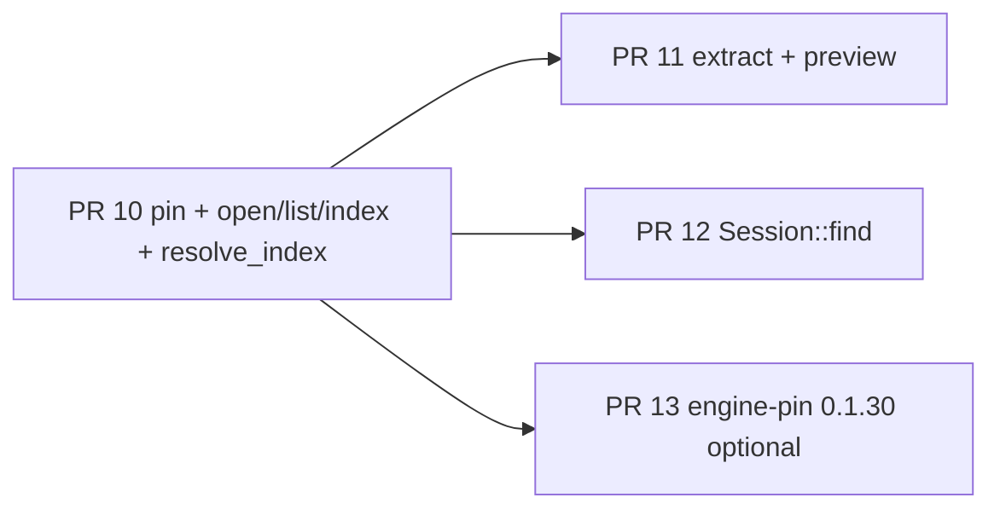

# Un-fake the in-process engine path (`ratarmount-session` 0.1.30)

| Field | Value |
|-------|--------|
| **Author** | Grok (design) |
| **Date** | 2026-09-04 |
| **Status** | Draft |
| **Consumer** | `ratarmount-rs-gui` (`origin/main` `78ff23e`, W0–W8 chrome merged). A local worktree may sit behind that SHA; implement against `origin/main`. |
| **Engine** | `ratarmount-rs` **v0.1.30** (`afda5c6`, tag `v0.1.30`, remote `hilather/ratarmount-rs`) |
| **Canonical engine API** | [`ratarmount-rs/docs/session-api.md`](https://github.com/hilather/ratarmount-rs/blob/v0.1.30/docs/session-api.md) · crate `ratarmount-session` |
| **Related** | `AGENTS.md`, `docs/architecture/01`–`05`, `docs/implementation/waves/W2.md` `W4.md` `W5.md` `W8.md`, `docs/engine/gui-embedder-support.md`, ADR 0001 |

This document is the implementation plan for the **next GUI slice**: replace the production `TODO(engine)` adapter with a real in-process `Session`. It is written against the **shipped** 0.1.30 signatures, not the 2026-08-29 G0 sketch.

---

## Overview

W0–W8 shipped explorer chrome on a fake in-memory catalog (`RGUI_FAKE=1` / `NativeApp::for_test()`). Production `open` without fake goes through `native/src/session.rs` and returns `{ code: Internal, retryable: false }` with `TODO(engine)`. Feature `session` is a reserved empty allowlist; `native/Cargo.toml` does not link any engine crate.

The engine now publishes `ratarmount-session` 0.1.30 with `Session::open` / `open_with_job`, `list_dirents_page`, `lookup`, `read_range`, `extract_to`, `find`, `IndexJob::run`, and `resolve_index`. `Error` has no `Busy`. `Session` is `Send + Sync` and **not** `Clone` (share via `Arc`). Default session graph has no `fuser`; TAR/ZIP/7z are always compiled; `--no-default-features` drops `formats-all` (libarchive/git/PDF/…) but **still always links `ratarmount-remote`** (`ureq`+tls, `ssh2` with `vendored-openssl`). That is not `http-export` and is not FUSE.

This slice pins that crate, stores `Arc<Session>` in the native handle table, and routes production open / list / lookup / close / index / extract / preview / find / `resolve_index` through it. The fake catalog stays for UI tests. No `readAll`. No JS archive bytes. No second index format. No `ratarmount` binary crate. No `http-export` / fuse / nfs / smb on the explorer path.

---

## Background & Motivation

### Current GUI (this repo, 2026-09-04)

| Surface | State |
|---------|--------|
| Chrome (W0–W8) | On `main`. Virtual list, extract UI, password modal, settings, argv, packaging scripts, paged find **UI**, X11 drop. |
| Production `open` | `native/src/session.rs::open_real`. `recreate: never` → `TODO(engine)` `Internal`. `if-invalid` / `always` → `{ jobId }` then `jobFailed` with the same shape. |
| `list` / `lookup` / `find` / `preview` / `extractPlan` | Always `FakeCatalog` (`commands.rs`). Production sessions never land in the handle table. |
| Extract | Fake path materializes catalog bodies into `PendingExtractItem { body: Vec<u8> }`. Production path calls `extract_to(None, …)` and fails `TODO(engine)`. napi already `thread::spawn`s `run_extract_job_unlocked`. |
| Index location | `resolve_index` is `TODO(engine)`. Native **probes sibling writability itself** (`NativeApp::sibling_dir_is_writable`) and returns `SiblingNotWritable`. Debug log: `rgui: resolved index path: (unresolved; TODO(engine) resolve_index / resolve_index_location) …` |
| Feature `session` | `session = []` in `native/Cargo.toml`. Comment: pin from engine git tag. |
| Packaging pin | `packaging/engine-pin` is **0.1.29**. W7 scripts do **not** claim a clean-machine tarball / `.app` that opens a TAR. |
| Landing docs | `START-HERE.md` still says “W3 + fake catalog”. `README.md` still says `ratarmount-session` is not in the engine tree. |

Gate tests already exist and **branch** on `session_feature_enabled()`:

- `native/src/w2_tests.rs`: 1k TAR, page size 50 × 2, extract one file from Rust; `production_open_never` / `production_open_if_invalid`.
- `native/src/w4_tests.rs`: fake extract/preview/cap; `read_range_and_extract_to_are_engine_todos`.
- `native/src/w5_tests.rs`: `resolve_index_is_engine_todo_and_does_not_invent_local_index_v1_keys`; sibling probe + remember-volume.
- `native/src/w8_tests.rs`: fake paged `find`.

Those tests are the contract this slice must turn green on the real path **without** weakening the fake-path regressions.

### Current engine (v0.1.30) — actual signatures

Crate: `/home/brewerm/git/ratarmount-rs/ratarmount-session/`. Contract: `docs/session-api.md`.

```rust
// ratarmount-session/src/lib.rs — public surface
pub use error::Error;                     // no Busy
pub use index_job::IndexJob;              // IndexJob::run (blocking)
pub use resolve::resolve_index;
pub use session::Session;                 // not Clone; Drop is close
pub use read::RangeReader;                // Read + Send, not Sync
pub use ratarmount_core::{IndexBuildHooks, IndexBuildTick};
pub use ratarmount_index::IndexLocation;  // Memory | Path(PathBuf)
pub use types::{
    DirCursor, DirEnt, DirPage, ExtractProgress, ExtractRequest, FindCursor, FindOpts, FindPage,
    IndexPhase, IndexPolicy, IndexProgress, OpenRequest, Overwrite, ReadRequest, Recreate,
    SourceSpec,
};
```

`Session` methods (blocking; embedders that need a job id run them on a worker):

```rust
impl Session {
    pub fn open(req: OpenRequest) -> Result<Self, Error>;
    pub fn open_with_job(req: OpenRequest, hooks: &IndexBuildHooks) -> Result<Self, Error>;
    pub fn list_dirents_page(&self, path: &str, cursor: DirCursor, limit: u32) -> Result<DirPage, Error>;
    pub fn lookup(&self, path: &str) -> Result<Option<DirEnt>, Error>;
    pub fn read_range(&self, req: ReadRequest) -> Result<RangeReader, Error>;
    pub fn extract_to(
        &self,
        req: ExtractRequest,
        progress: Option<&dyn Fn(ExtractProgress)>,
        cancel: Option<&AtomicBool>,
    ) -> Result<(), Error>;
    pub fn find(&self, pattern: &str, opts: FindOpts) -> Result<FindPage, Error>;
    // Drop is close. No close(self).
}
```

`IndexJob::run(req, hooks)` **forces** `Recreate::Always` and `recursive = false`, then `Session::open_with_job` and returns `IndexLocation` (session is consumed). It is the `--index-only` / CLI rebuild helper, **not** the explorer-open path.

`resolve_index(archive, policy, explicit_index, extra_dirs, recreate) -> Result<IndexLocation, Error>`:

- `Sibling` + unwritable parent + no usable file → `Error::SiblingNotWritable(PathBuf)`. Never `:memory:`.
- `UserCache` → `local-index-v1/{sha256}.sqlite` (never `meta-v3/`, never flattened XDG parent).
- `Recreate::Never` + missing sidecar → `NotFound` **even if the sibling parent is unwritable**.

Default list/find page if `limit == 0`: **200**. Engine cap `MAX_DIR_PAGE = 10_000`. GUI still clamps napi `limit` to **500**.

### Why now

The 2026-08-29 block (“no `ratarmount-session` crate”) is gone. Keeping `TODO(engine)` is no longer an architecture fallback; it is a product defect. W2/W4/W5/W8 checklists that waited on G0–G4/G3 can close against this crate. No external engine PR is required in this DAG.

---

## Goals & Non-Goals

### Goals

1. Depend on `ratarmount-session` **0.1.30** (git tag `v0.1.30`). `default-features = false` + documented allowlist. Enable native feature `session` for real.
2. Replace production `open` / `list` / `lookup` / `close` / index-job with `Session`. Keep `RGUI_FAKE=1` / `NativeApp::for_test()` fake catalog.
3. Real extract + text preview via `extract_to` / `read_range`. Native still clamps preview (default 8 MiB, ceiling 64 MiB). Never return whole-member bytes to JS. **No `readAll`.**
4. Call engine `resolve_index` **only as a post-success log** (never as an open gate). Stop inventing sidecar names. Stop the production sibling-dir writability probe. Map `SiblingNotWritable` from `Session::open` onto the existing W5 dialog.
5. Search box → `Session::find` paged (`FindCursor`). No dump of 2M hits.
6. Tests + docs in the same PR as each behavior change. Fake-path regressions stay green. New tests fail before the wire and pass after (1k TAR, page 50 × 2, extract one file from Rust).
7. Landing-page / wave / napi / architecture updates when signatures or user-visible behavior change.

### Non-goals

- Windows as a v1 gate (engine G6). Compile-when-possible only.
- Write overlay UI, auto-update, GPUIX browser/Wasm target, `bun run web`.
- Wayland / macOS / Windows file drop (W8 already limited to X11).
- Claiming a clean-machine portable tarball / macOS `.app` that opens a TAR (needs a compiled GPUIX binary **and** this session wire; W7 scripts stay honest).
- Inventing a second index format or reimplementing `resolve_index` / `local-index-v1` sha256 keys.
- Enabling `http-export`, `fuse`, `nfs`, `smb`, `http` on the session dep.
- Importing the `ratarmount` **binary** crate.
- Image decode/resize in Rust (napi `preview` `{ kind: 'image', png }` ). Native `PreviewKind` today is `Text | Skipped` only. **Stay `skipped: unknown` for non-text.** Follow-on polish.
- Engine `formats-all` (ISO, PDF, libarchive, git, …). v1 explorer is TAR/ZIP/7z + always-on compress. `ratarmount-remote` is still always-on in 0.1.30 even with `--no-default-features` (engine crate graph; not a GUI feature flag).
- `IndexJob::run` as the explorer-open implementation (it forces `Always` + non-recursive and drops the `Session`).
- Publishing `ratarmount-session` to crates.io (engine policy: do not publish this slice; embedders path/git-depend).
- Changing the napi contract’s opaque `cursor: string`, extract overwrite `'skip'|'replace'`, or adding `readAll`.

---

## Proposed Design

### Process shape (unchanged)

```
┌─────────────────────────────────────────────────────────────┐
│  Bun + React  (GPUIX reconciler)                            │
│  page of DirEnt, progress structs, preview text ≤ cap       │
└───────────────────────────┬─────────────────────────────────┘
                            │ napi-rs (still the only UI API)
┌───────────────────────────▼─────────────────────────────────┐
│  native cdylib                                              │
│  Mutex<NativeApp> handle table: id → SessionBackend         │
│  worker threads for index / extract (do not hold the mutex) │
└───────────────────────────┬─────────────────────────────────┘
                            │ Arc<ratarmount_session::Session>
┌───────────────────────────▼─────────────────────────────────┐
│  ratarmount-session 0.1.30 (default-features = false)       │
│  TAR/ZIP/7z + compress + compositing + remote               │
│  SQLite 0.7.x sidecar via resolve_index                     │
└─────────────────────────────────────────────────────────────┘
```

FUSE/HTTP toolbar buttons stay CLI spawn (`probeFeatures`). Do **not** enable `http-export` on the session dep.

### Dependency pin

**Decision: git tag, not crates.io, not a committed path dep.**

Engine `docs/crates-io-policy.md` (L3.5): `ratarmount-session` is **not published** on crates.io in this slice; embedders path-depend in-tree. This GUI is a **separate repo**, so the reproducible equivalent is a **git tag pin**.

```toml
# native/Cargo.toml
[features]
default = ["session"]
napi-addon = ["dep:napi", "dep:napi-derive", "dep:rfd"]
# Real Session path. Never enable fuse/nfs/smb/http-export here.
session = ["dep:ratarmount-session", "dep:secrecy"]

[dependencies]
# Engine crates.io policy: session is unpublished; pin the v0.1.30 tag.
# default-features = false → no formats-all. TAR/ZIP/7z + compress + compositing
# + ratarmount-remote are always-on in the engine crate (vendored-openssl via ssh2).
# Allowlist: (empty extras). Do not add formats-all, http-export, gzip-rapidgzip.
ratarmount-session = { git = "https://github.com/hilather/ratarmount-rs", tag = "v0.1.30", default-features = false, optional = true }
# Same caret as engine ratarmount-session (secrecy = "0.8"). Cargo.lock records the
# exact checksum after the first fetch (engine lock is 0.8.0 today). Do not use
# "=0.8.0" — a newer 0.8.x in the engine graph would duplicate the crate.
secrecy = { version = "0.8", optional = true }
```

**Why `default = ["session"]`:** CI today is `cargo test -p native` and `cargo clippy -p native --all-targets` with no extra features. If `session` stayed off-by-default, the real path would not run in CI. Production `napi build --features napi-addon` **adds** to default features, so the addon gets the engine. `RGUI_FAKE=1` / `for_test()` still short-circuit before `open_real`.

**Allowlist (documented, empty extras):**

| Feature | v1 explorer |
|---------|-------------|
| (implicit always-on) TAR, ZIP, 7z, compress, compositing, **remote** | yes — remote is not optional in 0.1.30 |
| `formats-all` / `formats` | **no** |
| `http-export` | **no** (in-process HTTP server; different from `ratarmount-remote` clients) |
| `gzip-rapidgzip` / `gzip-rapidgzip-isal` | **no** (follow-on perf) |
| session **features** named fuse/nfs/smb/http | **no** |

**Always-on remote cost:** `ratarmount-session` `Cargo.toml` depends on `ratarmount-remote` unconditionally. That crate pulls `ureq` (tls), `ssh2` with **`vendored-openssl`**, `suppaftp`/`jsonwebtoken`. PR 10 CI will compile OpenSSL from source. That is a feasibility/timeout risk, not a format-crate footnote. Keep `http-export` off. Follow-on (engine, not this DAG): feature-gate remote if the engine ever splits it.

CI fuse-free gate — **`cargo tree -i fuser` is the wrong tool** (`-i` exits non-zero when the package is absent). Do **not** pipe into `rg` (`ubuntu-latest` is not guaranteed to ship it; this repo’s app job uses `git grep`). Capture `cargo tree` first so a tree failure cannot be masked, then `grep -E` (always present). Absence of a match is **success**:

```bash
set -euo pipefail
assert_absent() {
  local tree
  tree="$(cargo tree -p native "$@" -e normal --prefix none -f '{p}')" || exit 1
  if printf '%s\n' "$tree" | grep -E '^(fuser|ratarmount-fuse|ratarmount-nfs|ratarmount-smb|ratarmount-http)($| )' >/dev/null; then
    echo "banned crate in graph" >&2
    exit 1
  fi
}
assert_absent
assert_absent --features napi-addon
```

The `if grep` form treats grep’s “no match” exit 1 as success (do not `grep && exit 1` under `set -e` without capturing). Optional (not a merge gate for the slice): `cargo check -p native --no-default-features --all-targets` so the stub graph still compiles.

**Cargo.toml test:** rewrite `native_cargo_toml_does_not_import_binary_crate`. Today it forbids the substring `http` on any non-comment `ratarmount-session` line; the git pin `https://github.com/...` would fail. Assert instead:

- no `ratarmount ` / `ratarmount=` binary crate
- the session dep line contains `default-features = false`
- banned **features** only: `http-export`, or `features = [...]` containing `fuse` / `nfs` / `smb` / `http` (not the URL)

**Local override (not committed):** developers with a sibling engine checkout may `[patch]` in `.cargo/config.toml` / an untracked `Cargo.toml`. The committed pin is the tag.

**Do not** import `ratarmount` (binary). Existing test already scans `native/Cargo.toml` for that.

### Handle table

Today (`native/src/state.rs`):

```rust
pub struct SessionState {
    pub source: String,
    pub catalog: FakeCatalog,
}
```

Target:

```rust
pub enum SessionBackend {
    Fake(FakeCatalog),
    Engine(Arc<ratarmount_session::Session>), // one Arc; do not wrap again
}

pub struct SessionState {
    pub source: String,
    pub backend: SessionBackend,
}
```

- `NativeApp::for_test()` / `RGUI_FAKE=1` → `Fake`.
- Production `open_real` success → `Engine(Arc::new(session))`.
- `close(session_id)` removes the map entry; last `Arc` drop runs `Session::Drop` (`MountSource::close`, Temp sidecar unlink).
- Do **not** `Clone` the engine `Session`. Clone the `Arc` for list/find/preview/extract workers.
- **Do not** store `Arc<EngineSession>` that itself holds `Arc<Session>` (double Arc). `EngineSession` is a mapper that holds `Session` by value for adapter-level tests, or methods on `&Session`.
- `Busy` stays a **native** synthesis (in-flight job for that window / `STUB_BUSY_DEST`). Engine v1 never emits `Busy`.

`EngineSession` in `native/src/session.rs` is a thin mapper for W2 adapter tests (open + list + extract_to). Engine `Session` has no `close(self)`; keep a thin `fn close(self)` that is `drop(self)` so `w2_tests.rs` (`session.close()`) still compiles:

```rust
pub struct EngineSession {
    inner: ratarmount_session::Session, // by value, not Arc
    source: String,
}

impl EngineSession {
    pub fn open(req: NativeOpenRequest) -> Result<Self> { /* map + Session::open */ }
    pub fn open_with_job(...) -> Result<Self>;
    pub fn list_dirents_page(&self, path: &str, cursor: Option<&str>, limit: u32) -> Result<DirPage>;
    pub fn lookup(&self, path: &str) -> Result<Option<DirEnt>>;
    pub fn find(&self, opts: &crate::types::FindOpts) -> Result<FindPage>;
    pub fn read_range(&self, path: &str, offset: u64, max_len: u64) -> Result<Vec<u8>>; // capped Vec stays in native
    pub fn extract_to(&self, req: NativeExtractRequest, progress, cancel) -> Result<()>;
    pub fn close(self) { drop(self); } // Drop is the engine close API
    pub fn into_arc(self) -> Arc<ratarmount_session::Session> { Arc::new(self.inner) }
}
```

GUI `ExtractRequest` **in PR 10** (engine field is required to compile `extract_to`):

```rust
pub struct ExtractRequest {
    pub members: Vec<String>,
    pub dest_dir: PathBuf,
    pub overwrite: Overwrite,
    pub allow_unsafe_paths: bool, // default false in extract_opts_to_request
}
```

Update the W2 error-path struct literal in the same PR. Thread `config.extract.allow_unsafe_paths` in **PR 11** NativeApp extract; adapter tests pass `false`.

When `feature = "session"` is off, keep today’s `engine_unavailable` stubs so `--no-default-features` still compiles. Default CI does not require that path; optional extra `cargo check --no-default-features` prevents stub bitrot.

### Type mapping (napi ↔ engine)

Native already has parallel enums (`crate::types::IndexPolicy`, `Recreate`, `Overwrite`, `DirEnt`, `DirPage`). Map at the adapter; do not leak engine types across napi.

| GUI / napi | Engine 0.1.30 | Notes |
|------------|---------------|--------|
| `source: string` | `SourceSpec::Path(PathBuf)` if no `://`, else `Url(String)` | v1 picker/argv are local files. `open_real` today requires `Path::is_file()`; keep that for `Path`. URLs skip the `is_file` check. |
| `policy: sibling\|user-cache\|explicit\|temp\|memory` | `IndexPolicy::{Sibling,UserCache,Explicit,Temp,Memory}` | Never send `CliCompat` (CLI/Python `:memory:` last resort). Reject `memory` unless `fake_or_test()`. |
| `explicitPath` | `OpenRequest.explicit_index: Option<PathBuf>` | Required by engine when `Explicit`. |
| `config.index.extra_dirs` | `OpenRequest.extra_dirs: Vec<PathBuf>` | Maps to `--index-folders` extras, not implicit sibling `""`. |
| `password?: string` | `Option<secrecy::SecretString>` | JS lifetime = that `open()` call. Native `discard_secret` after wrapping. Never log. |
| `recursive?: bool` | `bool` (default `false`) | v1 non-recursive. |
| `recursionDepth?: u32` | `Option<i32>` | `i32::try_from(u32)`; overflow → `Internal` `retryable: false`. Omit → engine default. |
| `recreate` | `Recreate::{Never,IfInvalid,Always}` | See open flow. |
| `DirCursor` | opaque napi `cursor: string` | Encode in native. JS must not parse. |
| `FindCursor` | separate opaque string | **Different type** from `DirCursor`. A list cursor must not decode as find. |
| `DirEnt.size: u64` | napi `i64` | Saturate at `i64::MAX`. |
| `DirEnt.archive_offset: Option<u64>` | napi `Option<i64>` | Catalog hint only; never a fetch key. |
| `Overwrite::{Skip,Replace}` | same | `'ask'` still rejected in `parse_native_overwrite`. |
| `ExtractRequest.allow_unsafe_paths` | `config.extract.allow_unsafe_paths` | **Add in PR 10** (required field on engine `ExtractRequest`). Default `false` in `extract_opts_to_request`. NativeApp threads config in PR 11. |
| `FindOpts.mode: 'glob'\|'fts'` | `FindOpts { fts: bool, … }` | `fts: mode == "fts"`. Engine may `ensure_fts5` only when `fts` or `fts:` prefix. |
| `FindPage.fts: bool` | napi `mode: string` | Map back to `"fts"` / `"glob"`. |
| `IndexPhase::{Scan,Write,Fts,Finalize}` | napi `phase: string` | `"scan"\|"write"\|"fts"\|"finalize"` (fake already emits `"scan"`). |
| `Error` variants | `ErrorCode` | 1:1 except `Busy` (native only) and `PreviewTooLarge` (native cap). |
| `IndexLocation::{Memory,Path}` | debug/status string | Path → `display()`; Memory → `":memory:"`. User-cache **badge** stays `"user cache"` (not the sha256 filename). |

### Opaque cursors

Fake catalog keeps `kset:{path}:{index}` (`catalog.rs::encode_cursor`). Engine listing is **name keyset**, not an integer offset. Do **not** reuse `kset:` for engine sessions.

Engine:

```rust
pub enum DirCursor { Start, AfterName { name: String } }
pub enum FindCursor { Start, AfterPath { path: String, offsetheader: Option<i64> } }
```

Native encoding (opaque to JS; version-prefixed so we can change it). **UTF-8 percent-encoding** (RFC 3986): encode every byte that is not unreserved (`A–Z a–z 0–9 - . _ ~`). In particular `%`, `:`, `/`, and non-ASCII become `%HH`. Decode is strict: reject truncated `%`, non-hex, and invalid UTF-8 after decode.

| Kind | Wire string |
|------|-------------|
| list start | omit `cursor` / `None` → `DirCursor::Start` |
| list next | `d1:` + percent-encode(UTF-8 `name`) |
| find start | omit → `FindCursor::Start` |
| find next | `f1:` + percent-encode(UTF-8 `path`) + `:` + `offsetheader` decimal, or empty if `None` |

**Find split:** strip the `f1:` prefix, then `rsplit_once(':')`. Because `:` inside the path is `%3A`, the last literal `:` is always the offset delimiter.

**Wrong-kind → `Internal`, `retryable: false`:**

| Cursor | Engine `list` | Engine `find` | Fake backend |
|--------|---------------|---------------|--------------|
| omit / `None` | `DirCursor::Start` | `FindCursor::Start` | existing |
| `d1:…` | decode name | **reject** | **reject** |
| `f1:…` | **reject** | decode path+offset | **reject** |
| `kset:…` | **reject** | **reject** | existing integer keyset |
| anything else | **reject** | **reject** | **reject** |

Tests (PR 10 list, PR 12 find): `f1:` rejected by `list`; `d1:` rejected by `find`; `kset:` rejected on engine backends; a member name containing `:` and `%` round-trips through `d1:`.

Last page: `nextCursor` is JSON `null`, not omitted (`regression_last_page_next_cursor_is_null_not_omitted` stays).

Napi `limit`: default 200, **max 500** (`clamp_limit`). Engine would allow 10_000; GUI does not.

### Open / index-job flow

Engine `Session::open` **already** calls `resolve_index` and may cold-build when `recreate` requires it. Explorer open must use `Session::open` / `open_with_job`, **not** `IndexJob::run`.

```mermaid
sequenceDiagram
    participant UI as React
    participant N as napi NativeApp
    participant W as worker thread
    participant S as Session
    participant R as resolve_index
    UI->>N: open(source, policy, recreate)
    alt fake_or_test
        N-->>UI: sessionId (FakeCatalog)
    else Recreate::Never
        Note over N: do not preflight resolve_index
        N->>S: Session::open
        Note over S: Sibling/UserCache Never short-circuit<br/>find_existing_* → NotFound (no resolve_index)
        alt missing sidecar
            S-->>N: NotFound
        else tarstats mismatch
            S-->>N: CorruptIndex
        else ok
            S-->>N: Session
            N->>R: post-success resolve_index(recreate=false) for log only
            N-->>UI: sessionId
        end
    else Recreate::IfInvalid or Always
        N-->>UI: jobId
        Note over N,UI: always jobId even on a warm sidecar (engine may emit no Scan ticks)
        N->>W: spawn (drop NativeApp mutex)
        W->>S: open_with_job(hooks)
        S->>R: resolve_index (inside Session; recreate=Always→true else false)
        alt SiblingNotWritable
            S-->>W: SiblingNotWritable
            W-->>UI: jobFailed retryable
        else cancel
            Note over W: cancel() already emitted jobCancelled;<br/>worker maps Error::Cancelled to no-op
            S-->>W: Cancelled
        else ok
            W->>N: insert Arc Session; set JobState.session_id
            W-->>UI: indexProgress* then jobSucceeded(sessionId)
        end
    end
```

**Policy remap (keep, GUI-owned):** `effective_open_policy` still maps remembered unwritable volumes `Sibling → UserCache` **before** calling the engine. That is user preference, not index-path invention.

**Stop the production sibling probe.** `open_real` today:

```rust
if policy == IndexPolicy::Sibling && !app.sibling_dir_is_writable(&source) {
    return Err(ApiError::sibling_not_writable(...));
}
```

After G4 this races the engine and disagrees on `Recreate::Never` (engine: `NotFound` if no sidecar, even when the parent is unwritable). **Delete the production probe** (`open_real` must not call `sibling_dir_is_writable`). Map `Error::SiblingNotWritable` from **`Session::open` / `open_with_job` only** onto the existing W5 dialog (`retryable: true`). Do not fail `open` because a logging helper returned `SiblingNotWritable`.

**`set_sibling_writable`:** after the probe is gone, the override **does nothing**. Remove the production call site. Remember-volume tests must not depend on it (`effective_open_policy` remaps `Sibling → UserCache` before open). Delete or stop calling `set_sibling_writable` from W5 tests.

Rewrite `sibling_not_writable_is_retryable_structured_error` so it actually reaches the engine through `open_real`. **Do not use the file-as-parent blocker for `NativeApp::open`.** That recipe (`resolve.rs` `resolve_sibling_not_writable`) writes a file named as the parent and joins `a.tar` under it — `Session::open` still returns `SiblingNotWritable` because `resolve_index` runs first, but GUI `open_real` returns **`NotFound` (`unknown archive`)** first (`Path::is_file()` is false, and you cannot `fs::copy` a TAR into a file-parent). The unix engine test that works with a **real TAR** is `resolve_sibling_not_writable_open` (chmod parent `0o555`).

`NativeApp::open` / `open_real` recipe (`cfg(unix)`):

1. Copy the archive into a `TempTree` directory (never `IfInvalid` on committed `native/tests/fixtures/hello.tar`).
2. `chmod 0o555` the **parent directory** (restore mode in a `Drop`/defer; skip/assert-soft if still writable as root).
3. `Recreate::IfInvalid` + `IndexPolicy::Sibling`.
4. **`open()` returns `Ok(OpenOutcome::Job { job_id })` — do not `expect_err`.** `if-invalid` / `always` always return `{ jobId }` (rlib runs `open_with_job` inline, then emits a terminal event). `take_events()` must contain `JobFailed { job_id, code: SiblingNotWritable, retryable: true }` and **no** `JobSucceeded`. Same shape as today’s TODO index job (`start_index_job` already returns `Ok(Job)` after `jobFailed`). Default config `recreate` is `if-invalid`, so the W5 dialog is this path in production.

Optional extra (does **not** exercise `open_real` or the job table): `map_engine_error(Session::open(file-as-parent archive))` or `resolve_index` on the file-as-parent path — that path **may** `expect_err`. No `is_file()` check.

UI: `explorer.ts` already `waitForJobSession` on `{ jobId }` and rejects with `CommandError` from `jobFailed`; the existing `catch` that opens `{ kind: 'sibling-not-writable' }` still runs. Do not add a second dialog on the raw event.

Windows: not a v1 gate; skip the chmod test with `cfg(unix)` rather than inventing an NTFS-only recipe this slice.

**Remember-volume `open` after remap (spell the assertion).** Keep `effective_open_policy(Sibling) → UserCache` as a **separate** unit test (no `open`). Then, without `set_sibling_writable`:

- `Recreate::Never` + remapped `UserCache` + no cache entry → engine **`NotFound`**, debug log contains `user cache` (or `user-cache`), **not** `SiblingNotWritable`. Committed `hello.tar` is OK here (`Never` does not write). Set `RATARMOUNT_LOCAL_INDEX_DIR` anyway so a later edit cannot pollute `~/.cache`.
- Do **not** `IfInvalid` on the committed fixture. A second test that UserCache actually builds: copy to TempTree, set `RATARMOUNT_LOCAL_INDEX_DIR` to that tree, `IfInvalid`, success, sidecar under the env dir (not next to the archive, not `meta-v3`).

**When is `SiblingNotWritable` raised?** Engine: `IndexPolicy::Sibling` + no usable sidecar + unwritable parent, on create (`IfInvalid` / `Always`). **Not** on `Never` + missing sidecar (`NotFound`).

**`IndexJob` wrapper:** GUI `IndexJob::start` becomes “run `Session::open_with_job` with `IndexBuildHooks { on_progress, cancel }`”. Do not call engine `IndexJob::run` here.

**`--index-only` plumbing (required in PR 10).** Today `open_for_launch` on `OpenOutcome::Job` reads `self.jobs.get(&job_id).and_then(|job| job.session_id)`. Production `alloc_job(JobKind::Index, None)` leaves `session_id: None`, so `--index-only` would fail with `index-only job produced no session`. After the wire:

| Path | IfInvalid / Always |
|------|--------------------|
| `NativeApp::open` (rlib / `cargo test` / `apply_launch`) | `begin_open_job` + **run `open_with_job` inline**, insert `Arc<Session>` into the handle table, **set `JobState.session_id`**, emit `jobSucceeded { sessionId }`. `open_for_launch` then finds that id (or, equivalently, return `OpenOutcome::Session` after inline completion — pick one and use it in both `open` and `open_for_launch`). |
| `napi_api::open` | `begin_open_job` returns `{ jobId }`, `thread::spawn` `run_index_job_unlocked` (must **drop the mutex** before `Session::open_with_job`). On success the worker inserts the handle and sets `JobState.session_id` the same way. |

`launch_index_only` then `close`s that session (sidecar remains). Add a production `--index-only` test on a TempTree TAR: leaves a 0.7.x sidecar next to the archive and drops the handle.

**Warm `Never` is a synchronous `sessionId`.** Holding `Mutex<NativeApp>` during `Session::open` of a huge archive can hitch the frame; v1 accepts this for `Never` (sidecar exists ⇒ catalog open is cheap). Follow-on: run `Never` off-mutex while still returning `sessionId` from the napi call (channel), without changing the JS contract.

**Warm `IfInvalid` / `Always` always return `{ jobId }`.** napi contract says jobId when an index must be built; GUI v1 still job-ifies every `if-invalid`/`always` even when the sidecar is reused (engine `index_job_warm_open_emits_no_scan` proves no Scan ticks). Document that sentence in `05-napi-contract.md` in PR 10. Existing `production_open_if_invalid` already accepts `Session` or `Job`.

Today napi `open` calls `app.open()` under `with_app` (holds the mutex). That must change for cold builds, or a cancel from JS cannot run and the GPUI loop stalls.

`IndexBuildHooks` (`ratarmount-core`):

```rust
pub struct IndexBuildHooks {
    pub on_progress: Option<Arc<dyn Fn(IndexBuildTick) + Send + Sync>>,
    pub cancel: Option<Arc<AtomicBool>>,
}
```

Map ticks via `IndexProgress::from_tick` already in the engine. Forward `Event::IndexProgress`. Cooperative cancel uses the same `JobState.cancel` `AtomicBool` already hooked to `cancel(jobId)`.

**Cancel vs `Error::Cancelled`:** `NativeApp::cancel` already sets `JobStatus::Cancelled` and emits `jobCancelled` immediately (`commands.rs`). Extract workers already no-op terminal events when status is not `Running`. The index worker must do the same: if `open_with_job` returns `Error::Cancelled` and the job is already `Cancelled`, **do not** emit `jobFailed { code: Cancelled }`. Never emit both `jobCancelled` and `jobFailed` for a user cancel. `Cancelled` is not retryable.

### `resolve_index` (stop inventing locations)

Engine helper (pass **`extra_dirs` from config**; never omit them):

```rust
pub fn resolve_index(
    archive: &Path,
    policy: IndexPolicy,
    explicit_index: Option<&Path>,
    extra_dirs: &[PathBuf],
    recreate: bool, // Always → true; IfInvalid and Never → false
) -> Result<IndexLocation, Error>;
```

**Do not fail `open` on a logging `resolve_index`.** A second call is **not** equivalent to `Session::open`’s internal resolution:

| Policy + recreate | `Session::open` | Standalone `resolve_index` |
|-------------------|-----------------|----------------------------|
| Sibling + `Never`, no sidecar, unwritable parent | `NotFound` (`find_existing_sibling_index` short-circuit; never calls `resolve_index`) | `resolve_sibling_index_location(..., recreate=false)` still hits `path_can_create_index` and returns `SiblingNotWritable` |
| Temp | one `TEMP_INDEX_SEQ` path, unlinked on `Drop` | **another** `temp_index_path()` (increments seq, mkdir `0700`) — log would lie and leak a dir |
| Always / IfInvalid create | uses the location `open` computed | a preflight with `Always` → `recreate=true` can skip existing files |

`Session::catalog_path` is `pub(crate)` + `#[cfg(test)]` only. This slice does **not** require an engine follow-on (`pub fn index_location(&self)` is a nice later patch, not in this DAG).

**Logging rules:**

1. Never preflight `resolve_index` as a gate on `open_real`.
2. On **successful** open, for `Sibling` / `UserCache` / `Explicit` only: call `resolve_index(..., extra_dirs, recreate=false)` for the debug/status line. The sidecar now exists, so the helper should find it. If that call errors, fall back to `index_location_hint` — **do not fail the already-open session**.
3. **Temp / Memory:** never call `resolve_index` for logging. Log `index_location_hint` (`"temp"` / `":memory:"`).
4. On **failed** open: log the policy hint (and `user-cache` after remember-volume remap). Do not call `resolve_index` on the `Never` + missing sidecar path (would mis-report `SiblingNotWritable`).
5. Delete the `(unresolved; TODO(engine) resolve_index / resolve_index_location)` string on the production success path.

**Do not** hash `local-index-v1` keys in this repo. User-cache **badge** remains `"user cache"` (`index_location_hint`); debug log may show the real sqlite path after a successful open.

**`RATARMOUNT_LOCAL_INDEX_DIR`:** engine UserCache dest is the engine’s `local-index-v1` (overridable by that env). GUI `clearLocalIndexCache()` wipes `PersistPaths.local_index_dir`, which already matches `docs/architecture/02-index-storage.md` (same XDG layout as the engine). Production: do not set the env (both sides use the same default). Tests that `open` with `UserCache` against `with_persist` **must** set `RATARMOUNT_LOCAL_INDEX_DIR` to the temp dir so they do not write into the developer’s `~/.cache/ratarmount/local-index-v1`.

### List / lookup / close

`NativeApp::list` / `lookup` today assume `session.catalog: FakeCatalog`. Dispatch on `SessionBackend`:

- Fake: existing `decode_cursor` / `list_slice`. `catalog.get(&path).is_none()` → `NotFound`.
- Engine: `normalize_archive_path`, reject wrong-kind cursors, then the **lookup-then-page** rule below. Encode `next_cursor` as `d1:…`.

`close`: drop handle. Engine `Drop` is the close API. Adapter tests may call `EngineSession::close(self)` (`drop`).

**`list` of a missing archive path: `NotFound`, matching the fake catalog and W1 tests.** Engine SQL `list_dirents_page` on an unknown parent returns an empty page (`COUNT` 0), which would make the UI show an empty folder instead of an error. Production list therefore:

1. Missing **session** → napi `NotFound` (unchanged).
2. `path == "/"` → `list_dirents_page` (root always lists; may be empty).
3. Otherwise `lookup(path)` first: `None` → `NotFound` (`path not found: {path}`). `Some` (file or dir) → `list_dirents_page` (a file yields an empty page, same as fake children-of-file).
4. Wrong-kind cursor → `Internal`.

Missing member `lookup` → `Ok(None)` (engine already). Test: engine session `list("/no-such-dir")` is `NotFound`, not an empty `DirPage`.

### Extract (W4)

Fake path **unchanged**: `PendingExtractItem.body` from `FakeCatalog` (tiny fixtures). PathEscape still rejected by `normalize_member_path` / `member_dest_path` before any write.

Production path today calls `extract_to(None, req)` and fails. Target:

1. **`begin_extract` (holds the mutex, must stay short):** validate overwrite (`skip|replace` only), session id, member path syntax (`normalize_member_path`). Clone `Arc<Session>`. Store **unexpanded** `members` + dest + overwrite + `allow_unsafe_paths` + cancel token. **Do not** expand directories here (`&mut self` cannot drop `Mutex<NativeApp>`). **Do not** copy member bytes into `PendingExtractItem`. **Do not** send any expansion to JS.
2. napi already spawns `run_extract_job_unlocked` after `with_app` returns the `jobId`.
3. **Worker (mutex already dropped):** if `members` is empty, call `extract_to` as extract-all (engine catalog walk; **skip native expansion**). Otherwise expand selected directories (below), then `extract_to` the file list. Re-lock only to emit `extractProgress` / terminal events (same as today’s `drive_extract_work` callback).
4. Engine streams 64 KiB copies; progress every member and every 8 MiB; cancel checked at those points. Cancel unlinks a truncated dest.

rlib `NativeApp::extract` still runs the worker inline after `begin_extract` (tests). Expansion happens on that inline worker too, not inside `begin_extract`.

**Selected directories are not equivalent to engine named extract.** Explorer `selectedMembers()` is `selectedPaths`, which includes directories (`app/explorer.ts`). Fake `FakeCatalog::extract_files` expands dirs to descendant **files**. Engine `extract_one_named` on a directory only `create_dir_all` and returns (`extract.rs`); it does **not** walk children. Passing `/dir-00` through would plan ~0 bytes and extract an empty folder.

Native expansion (**on the extract worker**, after dropping the mutex; PR 11):

- For each selected path: `lookup`; if file, keep it; if dir, BFS/DFS via `list_dirents_page` (limit 500) and collect **files only**.
- **Extract expansion must be complete:** no 250 ms cap on extract itself. If the walk exceeds 10_000 files, fail with `Internal` `retryable: false` (“selection too large to expand”) rather than silently extracting a subset.
- Pass the file list into `extract_to`. Empty `members` (Extract all) still means engine extract-all; do not expand.

`allow_unsafe_paths` is on the GUI request from **PR 10** (default `false`). PR 11 threads `config.extract.allow_unsafe_paths`.

W2 gate test `extract_one_file_to_temp_dir_from_rust` already calls `EngineSession::open` + `extract_to` directly — it becomes the adapter-level proof in PR 10 (**switch `open_request()` to `Recreate::IfInvalid`** on the TempTree TAR, or `Explicit` under the temp dir). NativeApp production extract is PR 11.

### extractPlan (no engine aggregate API)

Engine has no `extractPlan`. napi contract still requires dest-side counts + a **capped** conflict sample (50 / 10_000 rows / 250 ms). Fake `totals()` already filters `!is_dir` and expands dir selections (`hello.tar` has `dir-00`).

**Algorithm (native only; never dump the walk into React).** napi `extract_plan` today runs `app.extract_plan` under `with_app` (holds the mutex for the whole call). Change it like preview:

1. **`with_app` (short):** validate session, clone `Arc<Session>`, copy dest path + `allow_unsafe_paths` + selected `members`. Drop the mutex.
2. Walk **outside** `with_app` (rlib tests can call the same free function with an `Arc<Session>`).
3. Start a worklist of directories: extract-all → `["/"]`; otherwise each selected path that `lookup` says is a dir. Selected files go straight into the file list (sum `size`).
4. While the worklist is non-empty: `list_dirents_page(dir, cursor, 500)`. For each entry: if `is_dir`, enqueue; else accumulate `files += 1`, `bytes += size`, and dest-stat that file.
5. Apply **both** caps to the **walk and** dest-stat: `EXTRACT_PLAN_CONFLICT_SCAN_ROWS` (10_000 entries visited) and `EXTRACT_PLAN_CONFLICT_SCAN_MS` (250 ms wall). On cap: stop, `conflictsTruncated = true`, `files`/`bytes`/`conflictCount` are a **lower bound**. Sample `conflicts` at 50.
6. Directories never count toward `files`/`bytes`.

Do **not** implement the walk inside `NativeApp::extract_plan(&self)` as the napi path — that still holds the mutex via `with_app`. A `&self` helper used only by rlib tests is fine if tests do not share the process mutex; production napi must clone-and-drop first.

This is a substitute until the engine exposes SQLite `COUNT`/`SUM`. The existing fake 1k `extractPlan` test (`FakeCatalog::thousand_files`) stays. Add an engine-backed plan test on the 1k TAR in PR 11, plus a **subdirectory** TAR: select the dir path, plan `files`/`bytes` match the children, extract writes those children (not an empty folder).

### Preview (W4)

Hard rules: lookup **size first**; if `size > preview.max_bytes` (already clamped to 64 MiB on config load/save) → `{ kind: 'skipped', reason: 'too-large' }` **without** `read_range`. Default 8 MiB still refuses a 9 MiB member.

Otherwise:

```rust
let req = ReadRequest { path, offset: 0, max_len: cap as u64 };
let mut reader = session.read_range(req)?; // RangeReader, not Vec
let mut buf = Vec::new();
reader.take(cap).read_to_end(&mut buf)?;  // cap already ≤ 64 MiB
```

- NUL in buffer → `skipped: binary`.
- Else lossy UTF-8 text; `truncated` if `ent.size > buf.len()`.
- Directories → `skipped: unknown`.
- **Images:** out of scope. No image crate. No `{ kind: 'image', png }`. Non-text stays `skipped: unknown`. The “Extract and open with system” button already handles `too-large`; it can also handle `unknown` later. Do not decode in JS.

`read_range` length vs cap: today’s stub errors `PreviewTooLarge` if `length > max_len`. After the wire, native never asks for more than `min(file_size, cap)`. Keep a unit test that a 9 MiB member is skipped with **zero** `read_range` calls (lookup-only).

Clone `Arc<Session>`, **drop the NativeApp mutex**, then read. Filling 8 MiB under the mutex would stall cancel/list.

Passwords: encrypted member `PermissionDenied` + “password” maps to `BadPassword` in engine `map_member_io`. Surface that; W4 modal retries `open` with a password. Password still not stored.

### Find (W8)

Fake path stays paged on `FakeCatalog`. Production:

```rust
let opts = ratarmount_session::FindOpts {
    fts: mode == "fts",
    offset_order: false,
    include_hashes: false,
    fill_hashes: Vec::new(),
    limit,                 // already clamp_limit ≤ 500
    cursor: decode_find_cursor(opts.cursor)?,
};
let page = session.find(&pattern, opts)?;
```

Encode `page.next_cursor` as `f1:…`. Do not newest-wins-collapse (engine locate keeps versions). Do not dump 2M hits. `total_hint` may be `None` (engine often leaves it unset); UI already tolerates null.

Unknown `mode` still `Internal`.

### Error mapping

```rust
fn map_engine_error(err: ratarmount_session::Error) -> ApiError {
    match err {
        Error::NotFound => ApiError::not_found("not found"),
        Error::SiblingNotWritable(p) => ApiError::sibling_not_writable(format!(
            "The directory next to the archive is not writable: {}", p.display()
        )),
        Error::NotWritable(p) => ApiError::not_writable(p.display().to_string()),
        Error::BadPassword => ApiError::bad_password("password rejected or required"),
        Error::UnsupportedFormat(s) => ApiError::new(UnsupportedFormat, s),
        Error::CorruptIndex(s) => ApiError::new(CorruptIndex, s),
        Error::Cancelled => ApiError::new(Cancelled, "cancelled"),
        Error::PathEscape(s) => ApiError::path_escape(s),
        Error::Internal(s) => ApiError::internal(s),
    }
}
```

`retryable` stays on the `ErrorCode` table in `error.rs` (unchanged): `Busy | NotWritable | SiblingNotWritable` only. Engine has no `Busy`; native may still synthesize it.

Do not stringify engine errors into `GenericFailure` (`regression_command_errors_expose_code_and_retryable_fields`).

### Threading / mutex rules

| Call | Holds `Mutex<NativeApp>`? |
|------|---------------------------|
| `list` / `lookup` / `find` (one SQL page) | yes (short) |
| `preview` read up to cap | **no** — clone `Arc`, drop lock, read |
| `extractPlan` walk + dest-stat | **no** — `with_app` clones `Arc` then drops; walk outside |
| `begin_extract` validation | yes (short) — **no** directory walk |
| extract worker: dir expansion + `extract_to` / `open_with_job` | **no** |
| emit progress / insert handle | yes (brief) |

Reuse `thread::spawn` (already used for extract). Do not add rayon/tokio. Architecture’s “worker pool” can stay a spawn-per-job in v1; bound it later if needed.

`Session: Send + Sync` is already tested in the engine (`session_send_across_thread`). GUI `engine_session_and_index_job_are_send` stays.

### Fixtures

- Committed: `native/tests/fixtures/hello.tar` (small).
- Generated at test time: 1k ustar via `native/src/ustar_fixture.rs` (`write_thousand_member_tar`) in a `TempTree`. **Not** checked in.
- **Never** `Recreate::IfInvalid` / `Always` on the committed `hello.tar` (would write `hello.tar.index.sqlite` into the repo). Copy into `TempTree` first, or use `Explicit` under the temp dir.
- **W2 `open_request()` today passes `Recreate::Never` on a freshly written TempTree TAR.** Engine `Session::open(Never)` with no sidecar is `NotFound`. After `session` is default-on, `thousand_member_tar_pages_size_50_twice` and `extract_one_file_to_temp_dir_from_rust` would take the `Err` branch and `assert!(!session_feature_enabled())` — they would panic instead of listing/extracting. **Change `open_request()` (or those two gate tests) to `Recreate::IfInvalid` against the TempTree, or `IndexPolicy::Explicit` with a dest under the temp dir.** Keep `Never` only for the seeded-sidecar success case and the missing-sidecar `NotFound` case (`production_open_never`).
- `Recreate::Never` on `hello.tar` without a sidecar is **`NotFound`**, not `Internal`. Update `production_open_never_is_engine_todo` accordingly. Do not run `IfInvalid`/`Always` on the committed fixture.
- No 40 GiB archives in CI. 4 GiB remains manual.

### Fake catalog stays

`RGUI_FAKE=1`, `NativeApp::for_test()`, GPUIX `getByTestId` tests, 100k scroll test, password modal against `FAKE_ENCRYPTED_PASSWORD` — all keep the in-memory catalog. Production `NativeApp::production()` / napi `NativeApp::new()` without the env hit the engine.

Regression: a test that `for_test().open(fixture)` still returns a fake session and does not write a sidecar.

---

## API / Interface Changes

Napi **commands and events do not change**. Opaque `cursor`, overwrite `'skip'|'replace'`, errors `{code,message,retryable}`, preview cap 8/64 MiB stay.

Documented behavior changes in `docs/architecture/05-napi-contract.md`:

| Before (W2 stub) | After |
|------------------|--------|
| Production `open(never)` → `Internal` `TODO(engine)` | `Session::open`; missing sidecar → `NotFound`; mismatch → `CorruptIndex` |
| Production `open(if-invalid\|always)` → `{jobId}` then `jobFailed` `TODO(engine)` | `{jobId}` then `indexProgress*` + `jobSucceeded { sessionId }` (or structured failure). **`if-invalid`/`always` always return `{ jobId }` even when the sidecar is reused** (engine may emit no Scan ticks). |
| Production `list`/`lookup`/`find`/`preview`/`extract` | Real Session / `read_range` / `extract_to` / `find` |
| `resolve_index` unresolved debug line | Engine path string |
| Native sibling writability probe | Engine `SiblingNotWritable` on create |

`PreviewKind` stays `Text | Skipped` in native (no image variant). Contract’s image arm remains unimplemented; docs must say so explicitly (skipped `unknown`).

`native/package.json` `napi build --features napi-addon` is enough once `session` is a default feature. Add a comment in that file so nobody passes `--no-default-features`.

CI (`/.github/workflows/ci.yml` native job) additions:

```bash
# NOT `cargo tree -i fuser` (fails when fuser is absent).
# NOT `… | rg` (rg is not guaranteed on ubuntu-latest).
set -euo pipefail
assert_absent() { ... }   # see Dependency pin: capture cargo tree, then grep -E
assert_absent
assert_absent --features napi-addon

# existing:
cargo test -p native          # now compiles session (default) + vendored-openssl
cargo clippy -p native --lib --features napi-addon -- -D warnings
```

First CI run fetches `github.com/hilather/ratarmount-rs` at tag `v0.1.30` (public) and **builds OpenSSL via `ssh2/vendored-openssl`**. `ubuntu-latest` already has `build-essential`, `pkg-config`, and `perl`; if the first pin PR fails on a missing tool, add an apt step (`perl`, `pkg-config`, `libssl-dev` is not required when openssl is vendored). Expect a slower native job; do not weaken clippy/tests to compensate.

Optional (not a slice merge gate): `cargo check -p native --no-default-features --all-targets`.

`Cargo.lock` will grow; commit it in the pin PR.

---

## Data Model Changes

No SQLite schema change. Indexes remain 0.7.x (`INDEX_VERSION "0.7.0"`). GUI still must not invent `local-index-v1` keys.

`config.toml` keys unchanged. Passwords still stripped on load/save.

Handle-table memory: one `Arc<Session>` per open archive (factory mount + RO sqlite catalog). Extract/preview workers hold a clone of the `Arc` only.

Sidecar writes:

| Policy | Where |
|--------|--------|
| `sibling` | `{archive}.index.ptr` + `{archive}.index.{id}.sqlite` or well-known `.index.sqlite` |
| `user-cache` | engine `local-index-v1/{sha256}.sqlite` |
| `explicit` | `explicit_path` |
| `temp` | engine temp pid dir `0700`; unlinked on `Drop` |
| `memory` | tests / fake only |

---

## Alternatives Considered

### 1. crates.io pin vs git tag vs path

| Option | Pros | Cons |
|--------|------|------|
| **Git tag `v0.1.30` (chosen)** | Reproducible; matches engine policy (unpublished); CI can fetch | Requires network on first build; lockfile records the rev |
| crates.io `ratarmount-session = "=0.1.30"` | Familiar | **Not published** (`docs/crates-io-policy.md` L3.5). Would block the slice. |
| Path `../ratarmount-rs/ratarmount-session` | Convenient locally | Not reproducible; CI has no sibling checkout; agents would drift |

A `[patch]` for local engine work is fine **uncommitted**.

### 2. `IndexJob::run` vs `Session::open_with_job` for explorer open

| Option | Pros | Cons |
|--------|------|------|
| **`open_with_job` (chosen)** | Honors `IfInvalid` vs `Always`; keeps the `Session`; supports `recursive` | Embedder must run it on a worker |
| `IndexJob::run` then `Session::open(Never)` | Matches a literal “IndexJob” name in W2.md | Forces `Always` + `recursive=false`; drops the session; double-open |

W2.md was written against G2.1 `IndexJob::start(OpenRequest)`. The shipped API is `IndexJob::run` (rebuild helper) + `Session::open_with_job` (embedder open). Map the GUI job table onto `open_with_job`.

### 3. Keep the GUI sibling writability probe

| Option | Pros | Cons |
|--------|------|------|
| **Delete production probe (chosen)** | Single SoT; `Never` + missing sidecar is `NotFound` as the engine specifies | Tests that used `set_sibling_writable(false)` + `Never` must move to `IfInvalid` or a real unwritable parent |
| Keep probe as a fast-fail | Slightly cheaper | Diverges from G4; W5 explicitly forbids keeping it after G4 |

### 4. `formats-all` vs slim `--no-default-features`

| Option | Pros | Cons |
|--------|------|------|
| **Slim (chosen)** | Smaller graph; no libarchive/git/PDF in CI; matches G5.3 embedder story | ISO/CAB/… need a later allowlist bump |
| Default `formats-all` | Matches in-tree engine tests | Pulls libarchive etc.; extra system deps in CI; user did not ask |

TAR.gz / `.tar.zst` still work: compress is always-on.

### 5. Combine all wires into one PR vs a DAG

One mega-PR would thrash `session.rs` less but is not independently reviewable (pin + open + extract + find + docs). Splitting after the adapter exists is the compromise: PR 10 owns the crate pin, handle table, open/list/lookup/close/index/`resolve_index`, and adapter-level `extract_to`. Later PRs route NativeApp extract/preview/find without relitigating the pin.

---

## Security & Privacy Considerations

| Threat | Mitigation |
|--------|------------|
| Zip-slip extract | Engine `extract_to` rejects `..` / absolute / Windows prefixes unless `allow_unsafe_paths`. Native still pre-checks `normalize_member_path`. Default off. |
| Password in config / logs / recent | Unchanged. `SecretString` on the engine boundary; `discard_secret` after wrap; `OpenRequest` Debug already redacts. Recent stores paths only. |
| Sibling index on a shared directory | Default policy `sibling` is user-visible. Unwritable sibling → retryable dialog → user-cache (`0700`). |
| User-cache leakage across tests | Tests set `RATARMOUNT_LOCAL_INDEX_DIR` to a temp dir. |
| Preview decoder bombs | No image decode this slice. Text path is lossy UTF-8 of ≤ cap bytes. Size check before read. |
| World-readable `/tmp` indexes | `temp` policy is explicit + confirmed; engine Temp pid dir is `0700`. `/tmp` is not the implicit fallback. |
| Member names in logs | Debug index line logs **archive** path + sidecar path, not member names. Progress `current_path` is an existing napi field (archive-relative); do not eprint it under `RGUI_DEBUG` by default. |
| JS heap | No `readAll`. Preview text ≤ cap. Extract writes to dest_dir. `RangeReader` never holds the member as one `Vec` inside the engine; native’s preview `Vec` is capped. |

---

## Observability

- Keep `rgui: resolved index path: {display}` behind `RGUI_DEBUG=1` (and `last_index_debug_log` for tests). After a **successful** non-Temp open the display is the post-open `resolve_index(recreate=false)` path; Temp/Memory/failed open use the policy hint. Never the TODO string on the success path.
- `indexProgress` / `extractProgress` events already exist; fill them from `IndexBuildTick` / `ExtractProgress`.
- `jobFailed.{code,message,retryable}` unchanged.
- Crash log path unchanged; still no passwords, no member names.
- No new metrics backend in v1.

---

## Rollout Plan

This is a desktop app, not a staged service. Rollout = merge order + feature behavior.

1. **PR 10** lands the pin + production open/list. `bun run dev` without `RGUI_FAKE=1` can open a real TAR (once the napi addon is rebuilt with default features). Fake env still used by UI tests.
2. **PR 11** makes Extract to… / preview text work on real bytes. Password modal already exists.
3. **PR 12** points the search box at `Session::find`.
4. **PR 13 (optional)** bumps `packaging/engine-pin` 0.1.29 → 0.1.30 for CLI fetch. Does **not** claim clean-machine open-TAR.

**Rollback:** revert the PR. Fake catalog and `RGUI_FAKE=1` remain. No migration of user indexes (0.7.x unchanged). Sidecars written by GUI `IndexJob` / `Session::open` are CLI-mountable (engine G7.1/G7.2); reverting the GUI does not invalidate them.

**Feature flag:** native `session` default-on is the product path. `RGUI_FAKE=1` is the test/demo flag, not a rollout flag.

**Risk register**

| Risk | Severity | Mitigation |
|------|----------|------------|
| `Recreate::Never` + missing sidecar becomes `NotFound` (was `Internal` TODO) | Low (correct) | Update tests + 05-napi-contract. Default config is `if-invalid`. |
| Cold `open_with_job` under the napi mutex freezes GPUI | High | Spawn worker; drop mutex (mandatory in PR 10). |
| Preview/extract/`extractPlan` hold mutex while walking | High | Clone `Arc`; expand dirs on the extract **worker**; `extract_plan` napi drops `with_app` before the walk. |
| `extractPlan` walk is a lower bound when caps hit | Medium | Caps already in contract; dirs expanded to files; document. |
| Git fetch of engine in CI | Low | Public tag `v0.1.30`; commit `Cargo.lock`. |
| Compiling 7z/zip/tar **and vendored-openssl** (`ratarmount-remote` / `ssh2`) lengthens CI | **High** | Slim features still always-on remote. `ubuntu-latest` has gcc/perl/pkg-config; add apt if the first run fails. Timeout budget, not a format footnote. |
| IfInvalid on committed `hello.tar` dirties the tree | High | Tests copy to `TempTree` / use `Explicit`. Gate tests use `IfInvalid` on TempTree, not `Never` on a sidecar-less TAR. |
| UserCache tests pollute `~/.cache` | Medium | `RATARMOUNT_LOCAL_INDEX_DIR`. |
| Image preview still skipped | Low | Explicit non-goal; text + extract-and-open cover v1. |
| `set_sibling_writable` after probe removal | Medium | Stop using it. W5 `open_real` test: TempTree copy + **chmod 0o555 parent** + `IfInvalid` (`cfg(unix)`). Assert **`Ok(Job)` + `jobFailed` `SiblingNotWritable`**, not `expect_err`. File-as-parent is `map_engine_error` / `Session::open` only — it fails `Path::is_file()`. Remember-volume `Never` → `NotFound`, not `SiblingNotWritable`. |
| Logging `resolve_index` disagrees with `Never` / Temp | High | Never preflight as a gate; Temp never calls the helper; post-success `recreate=false` only. |
| `--index-only` `Job.session_id` is `None` | High | Inline worker sets `JobState.session_id`; test leaves a sidecar. |
| `cargo tree -i fuser` red CI | High | Capture `cargo tree`, `grep -E` (not `rg`); `set -o pipefail`; absence is success. |
| Cargo.toml `http` substring vs `https://` | High | Ban features, not URL. |

---

## Open Questions

None blocking. The following were decided from `AGENTS.md` + architecture + the shipped session API rather than left for product input:

- Pin source, feature allowlist, `session` as default, `open_with_job` vs `IndexJob::run`, delete production sibling probe, slim `--no-default-features`, skip image decode, keep fake catalog.

Follow-ons that are **not** this slice (no user decision needed now):

- Image decode/resize ≤ 2048 px in Rust.
- `gzip-rapidgzip` allowlist bump.
- Job-ify warm `Never` open without changing the JS contract.
- Engine `COUNT`/`SUM` for `extractPlan`.
- Engine `Session::index_location(&self)` so Temp debug logs can show the live path.
- Engine feature-gate for `ratarmount-remote` (always-on in 0.1.30).
- Clean-machine installer claim after a GPUIX binary is actually built in packaging CI.

---

## References

- Engine contract: `/home/brewerm/git/ratarmount-rs/docs/session-api.md` (v0.1.30)
- Engine crate: `/home/brewerm/git/ratarmount-rs/ratarmount-session/src/{lib,session,types,error,index_job,resolve,extract,read,locate}.rs`
- Engine G-list (canonical after crate exists): `/home/brewerm/git/ratarmount-rs/docs/tasks/gui-embedder-support.md`
- Engine crates.io policy: `/home/brewerm/git/ratarmount-rs/docs/crates-io-policy.md` (L3.5 unpublished)
- GUI snapshot (stale on “crate missing”): `docs/engine/gui-embedder-support.md`
- GUI napi: `docs/architecture/05-napi-contract.md`
- GUI adapter: `native/src/session.rs`, `commands.rs`, `state.rs`, `error.rs`, `types.rs`
- Gate tests: `native/src/w2_tests.rs`, `w4_tests.rs`, `w5_tests.rs`, `w8_tests.rs`
- ADR: `docs/adr/0001-in-process-session.md`
- Waves: `docs/implementation/waves/W2.md`, `W4.md`, `W5.md`, `W8.md`

---

## Key Decisions

1. **Git-tag pin `v0.1.30` of `hilather/ratarmount-rs`, `default-features = false`, empty extra allowlist.** crates.io is unpublished; a committed path dep is not reproducible. TAR/ZIP/7z stay always-on. Never `http-export` / fuse / nfs / smb. *Rationale:* engine L3.5 policy + AGENTS hard rule 9.

2. **Native feature `session` is real and default-on** (`session = ["dep:ratarmount-session", "dep:secrecy"]`). Fake catalog is `RGUI_FAKE=1` / `for_test()`, not a disabled Cargo feature. *Rationale:* CI `cargo test -p native` must compile and exercise the product path; napi `--features napi-addon` adds to defaults.

3. **Handle table holds `Arc<ratarmount_session::Session>` (one Arc).** `EngineSession` maps by value and exposes `close(self)` as `drop` for W2 tests. *Rationale:* shipped engine contract; avoid `Arc<EngineSession>` wrapping `Arc<Session>`.

4. **Explorer open uses `Session::open` / `open_with_job`, not `IndexJob::run`.** GUI job table + `IndexBuildHooks` wrap `open_with_job`. rlib inline worker **sets `JobState.session_id`** so `--index-only` / `open_for_launch` can close the handle. *Rationale:* `run` forces `Always` + non-recursive and consumes the session.

5. **Delete the production sibling writability probe. Do not fail `open` on a logging `resolve_index`.** Remember-volume remap `Sibling → UserCache` stays GUI-owned. User-cache badge stays `"user cache"`. Post-success `resolve_index(..., extra_dirs, recreate=false)` is log-only; Temp never calls it. *Rationale:* AGENTS hard rule 5; engine `Never` + missing sidecar is `NotFound`; Temp helper allocates a new path per call.

6. **Opaque cursors encode engine `DirCursor` / `FindCursor` separately** (`d1:` / `f1:`), UTF-8 percent-encoded, last-`:` split for find. Fake `kset:` stays on the fake backend only; wrong-kind → `Internal`. Napi limit max 500. *Rationale:* hard rule 3; names may contain `:` / `%`.

7. **Preview: lookup size, skip over cap, then `read_range` into a native buffer ≤ cap.** Text = lossy UTF-8. **Image decode is skipped (`unknown`) this slice.** *Rationale:* hard rule 1 + 7; no new image crate; native `PreviewKind` has no image arm today.

8. **Production extract stores unexpanded members; the worker expands directories after dropping the mutex, then `extract_to`.** `begin_extract` must not walk. Engine named-dir extract only `mkdir`s. Fake extract may still copy tiny catalog bodies. *Rationale:* hard rule 1; match `FakeCatalog::extract_files`; `begin_extract` holds `Mutex<NativeApp>`.

9. **`extractPlan` napi clones `Arc<Session>` and drops `with_app` before the BFS/DFS walk** (files only, recurse dirs, both scan caps). No engine aggregate API; do not dump paths to JS. *Rationale:* hard rule 3; same mutex class as preview / `open_with_job`.

10. **Cold index/extract run on a spawned thread with the NativeApp mutex released.** rlib `open`/`extract` still run the worker inline for tests (same pattern as today’s extract). *Rationale:* architecture threading; napi extract already does this.

11. **Direct `secrecy = "0.8"`** (same caret as engine) to construct `SecretString` for `OpenRequest.password`. `Cargo.lock` records the exact crate after fetch. *Rationale:* pin via lockfile; `=0.8.0` would duplicate the crate if the engine graph resolves a newer 0.8.x.

12. **Landing docs flip from “engine-blocked” to “production open uses Session” in the same PRs that make it true.** `docs/engine/gui-embedder-support.md` banner: engine `docs/tasks/gui-embedder-support.md` is canonical. *Rationale:* AGENTS documentation rule; snapshot file said it would flip when the crate exists.

13. **Optional last PR: `packaging/engine-pin` 0.1.29 → 0.1.30.** Do not claim clean-machine GUI installers. *Rationale:* W7 honesty; CLI bundle is not the list/extract backend.

14. **v1 platforms unchanged:** Linux x86_64 + aarch64, macOS arm64. Windows compile-when-possible, not a gate.

15. **Engine `list` of a missing path is `NotFound`** (lookup first), matching the fake catalog — not an empty page.

16. **`if-invalid` / `always` always return `{ jobId }`**, even on a warm sidecar. Document in 05.

17. **Fuse-free CI captures `cargo tree` then `grep -E` (not `rg`, not `cargo tree -i`).** `set -o pipefail`; absence of a match is success.

---

## PR Plan

Numbering continues after W0–W8 (`design.md` PR 1–9). Each PR is independently reviewable and mergeable. **No external engine PR.** Tests + invalidated docs land in the same PR. `cargo fmt` / clippy `-D warnings` / `cargo test -p native` / `bun run typecheck && bun test` before commit.



PR 11 and PR 12 may proceed in parallel after PR 10 (extract vs find touch different `NativeApp` methods; coordinate `session.rs` mapper helpers). Combine 11+12 only if they thrash the same adapter hunks in review.

---

### PR 10: Wire `ratarmount-session` 0.1.30 for open, list, lookup, close, and index jobs

- **PR title:** Wire `ratarmount-session` 0.1.30 for open, list, lookup, close, and index jobs
- **Files/components affected:**
  - `native/Cargo.toml`, root `Cargo.lock`
  - `native/src/session.rs`, `state.rs`, `commands.rs` (`open`/`list`/`lookup`/`close`), `error.rs` (engine error map), `napi_api.rs` (index worker spawn)
  - `native/src/w2_tests.rs` (`open_request()` → `IfInvalid`; `ExtractRequest.allow_unsafe_paths`; `close` stays), `w5_tests.rs` (TempTree + chmod 0o555 parent for `open_real`; drop `set_sibling_writable`; remember-volume `NotFound`), `w6_tests.rs` if `--index-only` production test lives there
  - `native/package.json` (comment: default features include `session`)
  - `.github/workflows/ci.yml` (fuse-absent scan, not `cargo tree -i fuser`; OpenSSL compile time)
  - Docs: `docs/implementation/waves/W2.md`, `W5.md` (consume `resolve_index` checkbox), `docs/architecture/01-architecture.md`, `02-index-storage.md`, `05-napi-contract.md`, `AGENTS.md` (G-list “crate missing” paragraph), `docs/engine/gui-embedder-support.md` (canonical-flip banner), `docs/implementation/plan.md`, `docs/design/design.md` (engine-blocked language), `START-HERE.md`, `README.md` (status; keep it a landing page), `docs/adr/0001-in-process-session.md` consequences line
- **Dependencies:** none (W0–W8 already on `main`; engine crate exists)
- **Description:** Pin `ratarmount-session` from `github.com/hilather/ratarmount-rs` tag `v0.1.30` with `default-features = false` and empty extra allowlist. Enable native feature `session` as **default**. Add `secrecy = "0.8"` for `SecretString`. Handle table stores `SessionBackend::{Fake, Engine(Arc<Session>)}` (**one** Arc). Production `open_real` maps `OpenRequest` and calls `Session::open` (`Never`) or `open_with_job` (`IfInvalid`/`Always`) with `IndexBuildHooks` hooked to `indexProgress` + `JobState.cancel`. **Do not preflight `resolve_index` as an open gate.** napi cold open returns `{ jobId }` then spawns a worker **without** holding `Mutex<NativeApp>`. rlib inline worker inserts the handle, **sets `JobState.session_id`**, emits `jobSucceeded` so `open_for_launch` / `--index-only` work. `cancel(jobId)` keeps immediate `jobCancelled`; worker maps `Error::Cancelled` to a no-op. **Remove the production sibling-dir probe** (and stop using `set_sibling_writable`). Map `SiblingNotWritable` from `Session::open` only. Remember-volume remap stays. `list`/`lookup`/`close` dispatch on backend; `list` of a missing path is `NotFound` (lookup-then-page). Encode `DirCursor` as opaque percent-encoded `d1:` strings. Adapter-level `extract_to` with `allow_unsafe_paths: false` so the W2 extract test compiles and writes dest bytes (NativeApp extract UI still fake until PR 11). Do not import the binary crate; do not enable `http-export`.
- **Tests (same PR):**
  - Change `open_request()` to `Recreate::IfInvalid` (TempTree / Explicit). `thousand_member_tar_pages_size_50_twice` — real `Session::open`, two pages of 50, no overlap (must **not** take the `TODO(engine)` branch).
  - `extract_one_file_to_temp_dir_from_rust` — `extract_to` writes `member_body(0)`; struct literal includes `allow_unsafe_paths: false`; `session.close()` still compiles.
  - `production_open_if_invalid` — `{ jobId }` then `jobSucceeded` with **`JobState.session_id` set** + `list` page of 50 from NativeApp.
  - `production_open_never` — missing sidecar → `NotFound` (not `SiblingNotWritable`); seeded sidecar → `sessionId`. Password not in logs/config.
  - Production `--index-only` on a TempTree TAR: sidecar remains, handle dropped.
  - `list("/no-such-dir")` on an engine session → `NotFound`.
  - Cursor: `kset:` and `f1:` rejected by engine `list`; a name containing `:` round-trips.
  - Fake regression: `for_test()` / `RGUI_FAKE=1` still uses `FakeCatalog` and does not write a sidecar.
  - `native_cargo_toml_does_not_import_binary_crate` rewritten: `default-features = false`; ban `http-export` / feature tokens, **not** the `https://` URL.
  - W5: no TODO string on success; no invented sha256 in GUI source. `SiblingNotWritable` through **`open_real`**: TempTree copy + **chmod parent `0o555`** + `IfInvalid` (`cfg(unix)`). **`open()` → `Ok(Job { job_id })`; `take_events()` has `JobFailed { code: SiblingNotWritable, retryable: true }` and no `JobSucceeded`. Do not `expect_err` on `open()` for `IfInvalid`.** File-as-parent only on `Session::open` / `map_engine_error` (no `is_file()`, that path may `expect_err`). Remember-volume: `effective_open_policy` unit test separate from `open`; `Never` + remapped UserCache + no cache entry → **`NotFound`**, log contains `user cache`, not `SiblingNotWritable` (set `RATARMOUNT_LOCAL_INDEX_DIR`). Optional TempTree `IfInvalid` writes the sidecar under the env dir.
  - Last-page `nextCursor` null regression stays green.
- **Docs:** tick W2 remaining boxes; tick W5 “Consume engine G4 `resolve_index`”; rewrite 01/02/05 “until G0/G4” paragraphs; **05: `if-invalid`/`always` always return `{ jobId }` even on a warm sidecar**; flip engine snapshot banner; landing status: production open lists a real TAR.

---

### PR 11: Real extract and text preview via `extract_to` / `read_range`

- **PR title:** Extract and preview real archive bytes through `Session`
- **Files/components affected:**
  - `native/src/session.rs` (`read_range` mapper)
  - `native/src/commands.rs` (`begin_extract` stores unexpanded members; worker expansion helper; `preview`; extractPlan walk as a free function on `Arc<Session>`)
  - `native/src/state.rs` (engine pending extract: **unexpanded** request + `Arc<Session>`, **not** `Vec<u8>` bodies)
  - `native/src/napi_api.rs` (preview **and** `extract_plan`: clone `Arc`, drop `with_app`, then read/walk)
  - `native/src/w4_tests.rs` (replace `read_range_and_extract_to_are_engine_todos` with real tests)
  - Docs: `docs/implementation/waves/W4.md`, `docs/architecture/05-napi-contract.md` (image still skipped), `README.md` (extract/preview of real members)
- **Dependencies:** PR 10
- **Description:** Production `begin_extract` stays short under the mutex: validate, store **unexpanded** members + `Arc<Session>`. The existing napi extract **worker** expands selected directories (files only, recurse via `list_dirents_page`) after the mutex is dropped, then `extract_to`. Empty `members` skips native expansion (engine extract-all). Do not copy member bytes into the job table. Thread `allow_unsafe_paths` from config (field already exists from PR 10). Engine named-dir extract only creates the folder. PathEscape still refuses before write (native + engine). `preview`: lookup size; skip `too-large` without reading; else `read_range` with `max_len = cap`; NUL → `binary`; else lossy UTF-8. **Image decode remains `skipped: unknown`.** `extractPlan`: napi clones `Arc` and drops `with_app`, then BFS/DFS (files only, both scan caps). Fake extract/preview tests stay. No `readAll`. No `'ask'` to native extract.
- **Tests (same PR):**
  - Production extract of one 1k-TAR member to a temp dir via `NativeApp::extract` (not only the adapter).
  - **Directory extract:** real TAR with a subdirectory; select the dir path; extract writes children; `extractPlan` `files`/`bytes` match those children (not 0).
  - Preview `<1 KiB` text from a real ustar (`hello\n`).
  - Default 8 MiB config refuses a 9 MiB member **without** `read_range` (lookup-only). Keep the fake-catalog version too.
  - PathEscape on an unsafe member still writes nothing (engine + native).
  - Fake `extract_plan_1k_dest_conflicts_samples_50` stays; add engine-backed plan on 1k TAR with planted dest conflicts (`conflicts.len() ≤ 50`, `conflictsTruncated`, `conflictCount ≥ 50`).
  - Password: encrypted-member `BadPassword` still does not persist the secret (fake path remains; add a comment if no encrypted fixture exists — do not add a huge encrypted fixture).
  - Regression: production extract job table must not contain a `body: Vec<u8>` for engine backends (source assertion or type-level: engine pending has no body field).
- **Docs:** tick remaining W4 engine-gap paragraph; 05 notes image preview still skipped.

---

### PR 12: Page `Session::find` from the search box

- **PR title:** Page production search through `Session::find`
- **Files/components affected:**
  - `native/src/session.rs` (`find` mapper, `f1:` cursor)
  - `native/src/commands.rs` (`NativeApp::find` dispatch)
  - `native/src/w8_tests.rs` (engine-backed paged find)
  - Docs: `docs/implementation/waves/W8.md`, `docs/architecture/01-architecture.md` (G3 stub sentence), `05-napi-contract.md` (find no longer TODO)
- **Dependencies:** PR 10 (not PR 11)
- **Description:** Production `find` calls `Session::find` with `FindOpts { fts: mode == "fts", limit, cursor: FindCursor, … }`. Encode `FindCursor::AfterPath` as opaque `f1:` strings (percent-encoded path, last-`:` offset split; not `d1:`, not fake `kset:`). Wrong-kind cursor → `Internal`. Clamp limit to 500. Fake catalog find stays for UI/100k tests. No dump of 2M hits. Do not enable FTS as a side effect of `open`. Search box UI already exists (W8 chrome).
- **Tests (same PR):**
  - Engine 1k TAR: `find` pattern `file-000` (or glob that hits many), `limit: 10`, two pages, no overlap, `nextCursor` opaque (`parse::<u64>()` fails).
  - Last find page `nextCursor == None`.
  - `d1:` and `kset:` rejected by engine `find`; a path containing `:` round-trips.
  - Fake `find_is_paged_and_does_not_dump_the_catalog` stays green.
  - Unknown mode still `Internal`.
- **Docs:** tick W8 “engine G3 stubbed” line to consumed.

---

### PR 13 (optional): Bump packaging `engine-pin` to 0.1.30

- **PR title:** Bump packaging engine-pin to 0.1.30
- **Files/components affected:** `packaging/engine-pin`, `docs/architecture/03-distribution.md`, `docs/implementation/waves/W7.md` (honest status; still no clean-machine claim), `packaging/` tests that snapshot the pin
- **Dependencies:** PR 10 (crate pin and CLI pin should match)
- **Description:** Change `packaging/engine-pin` from `0.1.29` to `0.1.30` so `fetch-engine-cli.sh` / distro `Depends: ratarmount (>= 0.1.30)` track the same tag as `native/Cargo.toml`. Do **not** claim a portable Linux tarball or macOS `.app` that opens a TAR on a clean machine. Standalone scripts still refuse to invent a stub CLI. If GitHub release assets for `v0.1.30` are missing, the fetch script already fails closed — leave that failure, do not stub.
- **Tests:** `bash packaging/run-tests.sh` (pin, Depends field, no duplicate CLI).
- **Docs:** 03 version pin sentence; W7 honest status (session is wired in-process; installer claim still blocked on a compiled GPUIX binary in packaging CI).

---

### Explicitly not in this DAG

- Image preview decode/resize.
- `http-export` on Session / in-process HTTP button (CLI spawn remains).
- Windows-as-v1-gate.
- Wayland/macOS/Windows drop.
- `formats-all`.
- Clean-machine GUI installer “opens a TAR” claim.
- Reimplementing `resolve_index`.
- `readAll`.
