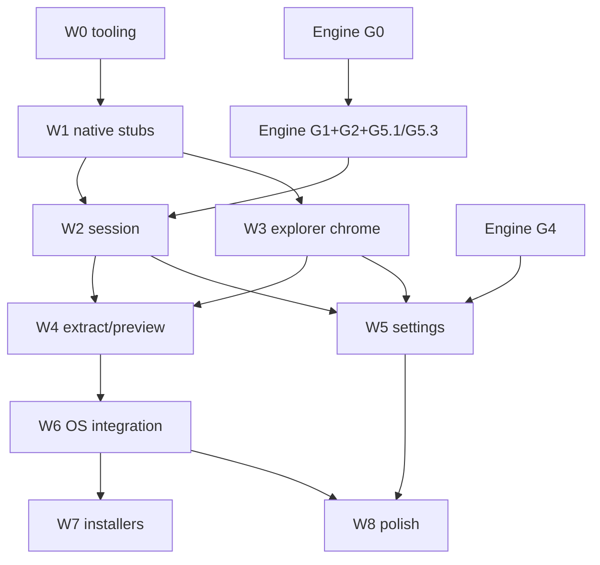

# Implementation plan — waves of subagents

This is the **first-class** plan an orchestrator hands to waves of subagents. Policy: [`../../AGENTS.md`](../../AGENTS.md). Consolidated design + parseable PR Plan: [`../design/design.md`](../design/design.md). Wave checklists: [`waves/`](waves/).

**Do not** scaffold `app/` or wire `native/` except as W0/W1. Engine G0–G7 are **external** (ratarmount-rs), not PRs in this repository.

The G0–G7 task list **working copy** is [`../engine/gui-embedder-support.md`](../engine/gui-embedder-support.md) until an **external engine PR** copies it to `ratarmount-rs/docs/tasks/gui-embedder-support.md` (not in the engine tree as of 2026-08-29).

## Hard rules (every wave)

1. Never materialize an archive, an index, or a member larger than the preview cap as a JS `Uint8Array` / Node `Buffer` / Bun `Blob`.
2. Do not use the GPUIX browser/Wasm target. Desktop napi-rs only. No `bun run web` as the app path.
3. Listing is paged from SQLite. No load-all-paths into React state. Opaque `cursor: string`; no raw `offset: u64` paging API.
4. FUSE is optional UX, not the product.
5. Indexes are SQLite 0.7.x, CLI-interoperable. Do not invent a second format. Do not reimplement `resolve_index` in the GUI.
6. No `readAll` napi command. Native `extract.overwrite` is `'skip' | 'replace'` only.

## Suggested first slice

- **Engine (ratarmount-rs, external):** G0 (drop task list + crate home) + G1 + G2 + G3; G5.1/G5.3 with G1 or as explicit gates.
- **GUI (this repo):** W0 + W1 + W2 + W3 virtual list of **one TAR**.
- W3 may ship on a fake catalog; W2 replaces the fake once G0+G1+G2 merge.

## Wave table

| Wave | Repo | Goal | Depends on | Owner role | Parallel with |
|------|------|------|------------|------------|---------------|
| G0–G7 | **ratarmount-rs** (external) | session API, IndexJob, resolver, Windows lib | — | engine | W0, W1, W3 (fake) |
| W0 | gui | GPUIX hello, native stub, CI skeleton | docs seed | tooling | engine G* |
| W1 | gui | napi stubs + self-test + fake catalog | W0 | native | — |
| W2 | gui | real Session behind napi | W1 + **G0+G1+G2+G5.1/G5.3** | engine-integration | **W3** |
| W3 | gui | explorer chrome: open, breadcrumbs, virtual list | W1 (fake OK) | UI | **W2** |
| W4 | gui | extract + preview + jobs + password modal | W2 + W3 | **one agent** (UI+native) | — |
| W5 | gui | config.toml + index policies | W2 + **W3** + **G4** | **one agent** (UI+native) | W6 can start after W4 if G4 lags |
| W6 | gui | argv, desktop/plist/registry | W4 | packaging / desktop | may overlap W5 |
| W7 | gui | installers, CLI bundle/Depends | W6 + engine packages | packaging | — |
| W8 | gui | search, fuse/http, a11y, 100k perf | W5 + W6 | mixed | — |

Default for W4 and W5: **a single agent** owns both `native/` and `app/` in that PR. Parallelize only with an explicit file split in the spawn prompt (`native/` vs `app/`).



## Engine gating — what GUI can fake vs what must wait

| GUI work | May fake | Must wait |
|----------|----------|-----------|
| W0 hello window | n/a | — |
| W1 commands | fake catalog, dummy `indexProgress` | — |
| W3 virtual list | fake `list` pages | — |
| W2 open/list/lookup/close/index job | keep fake behind `RGUI_FAKE=1`; real path feature-gated | **G0 + G1 + G2 + G5.1 + G5.3** |
| W4 extract/preview | never extract-in-JS | G1.5 `extract_to`, G1.4 `read_range` |
| W5 policies | UI forms + in-memory config | **G4** `resolve_index` + `SiblingNotWritable` |
| W8 search | — | **G3** paged find |
| W8 HTTP button | spawn CLI fallback | G5.4 optional |
| W7 installers | — | engine **release assets** for bundled CLI |
| Windows GUI | compile native without fuse | **G6** |

### Engine gate check (run before spawning PR 4 / 5 / 6 / 9)

```bash
ENGINE="${RATARMOUNT_RS:-../ratarmount-rs}"
# Working G-list (this repo) until the external engine PR lands:
test -f docs/engine/gui-embedder-support.md
# After the engine PR: test -f "$ENGINE/docs/tasks/gui-embedder-support.md"

# PR 4 (W2): G0 crate home + G1 session + G2 IndexJob + G5.1 Send + G5.3 fuse-free
if test -f "$ENGINE/ratarmount-session/Cargo.toml"; then
  cargo check --manifest-path "$ENGINE/Cargo.toml" -p ratarmount-session --no-default-features
else
  echo "G0.2 not a dedicated crate; check ratarmount-core::session + --no-default-features"
  cargo check --manifest-path "$ENGINE/Cargo.toml" -p ratarmount-core --no-default-features
fi
# G5.3 fallback if default features still pull fuse: native/Cargo.toml
#   ratarmount-session = { ..., default-features = false, features = [/* allowlist */] }

# PR 5 (W4): G1.4 read_range + G1.5 extract_to — covered by cargo test -p ratarmount-session
# PR 6 (W5): G4 resolve_index + SiblingNotWritable
rg -n "SiblingNotWritable|local-index-v1" "$ENGINE/ratarmount-index" "$ENGINE/ratarmount-session" 2>/dev/null || true
# PR 9 (W8): G3 paged find
rg -n "FindPage|list_dirents_page" "$ENGINE" --glob '*.rs' | head
```

If blocked on engine API: implement against the G0 sketch in [`../engine/gui-embedder-support.md`](../engine/gui-embedder-support.md) and leave `TODO(engine)`. **Do not invent a second index format.** **Do not import the `ratarmount` binary crate** to reach `factory.rs`.

## Subagent isolation (worktrees must not collide)

| Role | Owns (write) | Must not touch |
|------|----------------|----------------|
| tooling (W0) | `app/` scaffold, `native/` stub crate, CI workflow, README run section | architecture docs 01–05 (already seeded) |
| native (W1, W2) | `native/` | `app/` components except the documented addon import |
| UI (W3) | `app/` | `native/` command implementations; may consume napi types |
| W4 / W5 | **one agent:** `native/` + `app/` for that wave | packaging/; do not start W5 `app/` until W3 (PR 3) is merged |
| packaging (W6, W7) | `integrations/`, `packaging/`, argv in native main, Info.plist | explorer React tree except association settings widgets |
| engine repo | `ratarmount-rs` only | **never** this GUI repo; GUI never pushes to the engine |

## Per-wave spawn prompts (pasteable)

Every spawn includes required reading, hard rules, files not to touch, engine gate, worktree name, and this Deliverable:

```text
Deliverable:
- Code as specified in docs/implementation/waves/Wn.md
- Tests: <native cargo and/or GPUIX getByTestId>
- Docs updated in the same change: docs/implementation/waves/Wn.md checklist,
  plus any contract/arch drift in docs/architecture/05-napi-contract.md
- Hard rules: no readAll; no browser target; no JS bytes over cap;
  no load-all-paths; FUSE optional; 0.7.x only; extract overwrite skip|replace only
- cargo fmt / bun equivalent
- One commit, complete sentence, do not push
```

### W0 — tooling (`worktree: w0-scaffold`)

```text
You are the W0 tooling agent in ratarmount-rs-gui.
Required reading: AGENTS.md, docs/architecture/01–05, docs/implementation/waves/W0.md.
Do NOT rewrite docs/architecture or docs/design/design.md.
Do NOT create Electron/webview. Do NOT add `bun run web` as the app target.
Files you own: app/ (GPUIX template), native/ stub crate, .github/workflows/, README how-to-run.
Files you must not touch: docs/architecture/01–05, docs/design/design.md.
Engine gate: none.
Done-when: bun run dev opens 1100×720 window titled "ratarmount" (manual smoke).
Automated tests (required): cargo test -p native trivial native_crate_links; CI skeleton runs it.
Window-title smoke is waived as manual (AGENTS.md W0 waiver).
```

### W1 — native (`worktree: w1-napi-stubs`)

```text
You are the W1 native agent.
Required reading: AGENTS.md, docs/architecture/05-napi-contract.md (SoT types), waves/W1.md.
Implement napi stubs matching 05 types: DirPage/DirEnt/FindPage/Config, opaque cursor string,
extract overwrite skip|replace only, extractPlan, jobFailed.retryable, policy memory test-only.
Files you own: native/. Addon import note in app/ only.
Files you must not touch: explorer chrome, packaging/, architecture docs except 05 if signatures drift.
Engine gate: none. Do not link ratarmount crates.
Tests: cargo test -p native / native --self-test; paged fake list; reject extract overwrite 'ask'.
```

### W2 — engine-integration (`worktree: w2-session`) — **parallel with W3**

```text
You are the W2 engine-integration agent. Parallel with W3 after W1; do not edit app/ chrome.
Required reading: 01–05, waves/W2.md, docs/engine/gui-embedder-support.md (working G-list).
Engine gate BEFORE coding:
  ENGINE="${RATARMOUNT_RS:-../ratarmount-rs}"
  test -f docs/engine/gui-embedder-support.md
  cargo check -p ratarmount-session --no-default-features   # or ratarmount-core::session
Gate: G0 + G1 + G2 + G5.1 Session:Send + G5.3 fuse-free defaults.
Fallback if G5.3 late: default-features=false + documented allowlist. Never import ratarmount binary crate.
Consume engine resolve_index / resolve_index_location; do NOT reimplement local-index-v1 naming.
Pre-G4: today's CLI order (sibling / XDG ratarmount parent flattened names / memory last resort).
Files you own: native/, native/tests/fixtures/, native/Cargo.toml.
Files you must not touch: app/ components.
Tests: 1k TAR, page size 50 × 2, extract one file from Rust tests. Keep RGUI_FAKE=1 fallback.
```

### W3 — UI (`worktree: w3-explorer-chrome`) — **parallel with W2**

```text
You are the W3 UI agent. Parallel with W2 after W1. Fake session is enough.
Required reading: 05-napi-contract.md, waves/W3.md. Explorer chrome — not browser/Wasm.
Files you own: app/.
Files you must not touch: native/ command implementations, packaging/.
Engine gate: none.
Done-when: picker, breadcrumbs, virtual list, enter dir, go up.
Tests: GPUIX getByTestId open, list, crumb-*; React state is page-sized, not the full catalog.
```

### W4 — extract/preview (`worktree: w4-extract-preview`) — **one agent**

```text
You are the W4 agent (single owner of native/ + app/ for this wave unless spawn says otherwise).
Required reading: 05 overwrite protocol, waves/W4.md.
Depends: W2 + W3 merged (PR 3 and PR 4).
Engine gate: G1.4 read_range + G1.5 extract_to (same check as W2 session tests).
Implement extractPlan then extract(skip|replace). Config ask is UI-only.
extractPlan returns files/bytes/conflictCount + conflicts sample ≤ 50 + conflictsTruncated.
Native dest-stat cap: 10_000 rows or 250 ms. Not a job in v1.
Password modal on BadPassword; password JS-lifetime = the open() call only.
Tests: extract fixture; preview <1 KiB text; default 8 MiB config refuses 9 MiB member
(this is NOT the 64 MiB ceiling — that clamp is W5). PathEscape on unsafe.tar.
extract-all extractPlan on a 1k fixture with 1k dest conflicts: conflicts.length ≤ 50,
conflictsTruncated true, conflictCount ≥ 50 — do not put 1k paths in the page.
Do not add readAll. Do not pass overwrite 'ask' to native extract.
```

### W5 — settings (`worktree: w5-settings`) — **one agent**; depends PR 3 and PR 4

```text
You are the W5 agent (single owner of native/ + app/ settings).
Required reading: docs/architecture/02-index-storage.md (today's CLI vs post-G4), waves/W5.md.
Depends: PR 3 (explorer chrome) AND PR 4 (session). Do not start app/ settings until W3 is merged.
Engine gate: G4 resolve_index + SiblingNotWritable
  rg SiblingNotWritable "$ENGINE/ratarmount-index" "$ENGINE/ratarmount-session"
Consume G4 helpers; do not write flattened names into $XDG_CACHE_HOME/ratarmount/ (legacy CLI parent).
Hide policy memory. Tests: config round-trip; preview.max_bytes=65MiB clamps to 64MiB.
```

### W6 — OS integration (`worktree: w6-os`)

```text
You are the W6 packaging/desktop agent.
Required reading: docs/architecture/04-os-integration.md, waves/W6.md.
Files you own: native argv, integrations/, docs/qa-os-integration.md (CREATE this file — it does not exist yet).
Windows ExtractTo: ratarmount-gui.exe --extract-to -- "%1"  (%1 is the ARCHIVE).
--silent maps ask → skip; must not hang.
Tests: argv unit test that --extract-to -- archive.tar does not use archive as destDir; PathEscape on extract-here.
```

### W7 — installers (`worktree: w7-packaging`)

```text
You are the W7 packaging agent.
Required reading: docs/architecture/03-distribution.md (distro Depends vs standalone bundle).
Engine gate: ratarmount-rs release assets for bundled CLI (standalone only).
deb/rpm: Depends: ratarmount (>= pin); do NOT ship /usr/bin/ratarmount.
Portable / .app / msi: bundle CLI next to the GUI.
```

### W8 — polish (`worktree: w8-polish`)

```text
You are the W8 mixed agent.
Engine gate: G3 paged find; G5.4 HTTP optional (else spawn CLI).
Search is paged find — no dump of 2M hits. Hide fuse/http when missing.
Tests: 100k scroll with page-sized React state; find paged; fuse hidden when probe fails.
```

## Definition of done per wave

A wave is done when **all** of:

1. Checklist in `docs/implementation/waves/Wn.md` is checked in the **same PR** that lands the code.
2. Tests named above pass locally and in CI (do not skip/weaken to go green). W0 window smoke is the documented manual waiver; the trivial `cargo test -p native` is not waived.
3. Hard rules 1–6 are not violated (review `native/` public fns).
4. Docs invalidated by the change are updated in the same change (`AGENTS.md` trigger table).
5. Code review has happened (implementation is not done until reviewed).

Do **not** treat the wave checklist as the only source of truth for “done” — tests must pass.

## How `/execute-plan` maps onto the PR Plan

`/execute-plan` parses `## PR Plan` in [`../design/design.md`](../design/design.md) (same content as the skill design document). Each `### PR N:` is one mergeable change in **this** repo.

| PR | Wave | Dependencies | Engine gate (not a PR here) |
|----|------|----------------|-----------------------------|
| PR 1 | W0 | None | — |
| PR 2 | W1 | PR 1 | — |
| PR 3 | W3 | PR 2 | none (fake OK); **parallel with PR 4** |
| PR 4 | W2 | PR 2 | **G0+G1+G2+G5.1/G5.3**; **parallel with PR 3** |
| PR 5 | W4 | PR 3, PR 4 | G1 extract + read_range |
| PR 6 | W5 | **PR 3, PR 4** | **G4** |
| PR 7 | W6 | PR 5 | — |
| PR 8 | W7 | PR 7 | engine release assets |
| PR 9 | W8 | PR 6, PR 7 | G3 find; G5.4 HTTP optional |

External (not a GUI PR): copy `docs/engine/gui-embedder-support.md` into `ratarmount-rs/docs/tasks/gui-embedder-support.md` (G0.1). Until that lands, this snapshot is the working G-list.

- Engine G-phases appear in PR **Description** as gates. Do not open G-phase PRs in this repository.
- PR 1 must **not** rewrite architecture docs (already seeded).
- If G0/G1+G2 are missing when PR 4 would start: land the real-path skeleton feature-gated, keep fake default, leave `TODO(engine)` — or delay PR 4 and still merge PR 3.
- PR 6 waits for PR 3 so settings `app/` does not race explorer chrome.
